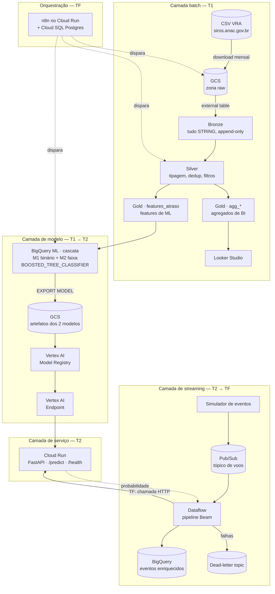

# PRD — Plataforma de Predição de Atraso de Voos (VRA/ANAC)

**Product Requirements Document**

---

## 1. Identificação do documento

| Campo | Valor |
| --- | --- |
| Produto | Plataforma de Predição de Atraso de Voos |
| Código do repositório | `ANAC-PDM` |
| Disciplina | PDM_BIA — Processamento de Dados Massivos · INF/UFG |
| Versão do documento | 1.2 |
| Data | 10/09/2026 |
| Estado | Aprovado para execução |
| Autores | Igor Reis Braziel · João Henrique F. Simielli · Bruno Moreira Lavalli Calura · João Pedro de Castro Gomes Fernandes |
| Documentos relacionados | [`enunciados/trabalho-1.md`](enunciados/trabalho-1.md) · [`enunciados/trabalho-2.md`](enunciados/trabalho-2.md) · [`enunciados/trabalho-final.md`](enunciados/trabalho-final.md) |

### 1.1 Histórico de revisões

| Versão | Data | Autor | Descrição |
| --- | --- | --- | --- |
| 1.0 | 18/08/2026 | Grupo | Versão inicial. Consolida decisões de arquitetura, requisitos das três entregas, métricas-alvo, glossário e dicionário de dados. |
| 1.1 | 18/08/2026 | Grupo | Três blocos de mudança. **(a) Fonte de dados:** substituída a raspagem de CSV pela **API REST oficial do VRA** (`sas.anac.gov.br/sas/vra_api`), descoberta após o portal `gov.br` se mostrar inacessível a cliente automatizado — reescreve RF-001 e resolve **P-04**. **(b) Dicionário de dados:** a [§10.2](#102-dicionário-de-dados--vra-bruto) foi substituída pelo schema **verificado** de 20 campos; a versão 1.0 presumia 13 campos e estava incorreta. **(c) Predição de faixa:** especificado o **modelo em cascata** (binário + faixa) na nova [§6.5](#65-modelo-em-cascata--binário--faixa), **como proposta pendente de ratificação pelo grupo** — aberta em **P-08**. A exclusão de "segundo modelo" e "multiclasse" da [§5.2](#52-fora-de-escopo) está *suspensa*, não revogada; tudo que depende de M2 está marcado *(condicional a P-08)*. Correção associada: o limiar de 15 min **não** é o padrão ANAC, como afirmavam as §§3.1 e 11 — a ANAC considera pontual até 30 min. |
| 1.2 | 10/09/2026 | Grupo | **Fonte de dados do T1 revertida para CSV.** A ingestão histórica do T1 passa a baixar os CSVs mensais do VRA publicados em `siros.anac.gov.br` (um arquivo por mês, via script, sem WAF) em vez de chamar a API REST — os arquivos já haviam sido baixados pelo grupo antes da carga da Bronze. Reescreve [§3.3](#33-fonte-de-dados), RF-001 e RF-001b. A API REST **não** foi removida do projeto: continua documentada em [§3.3.1](#331-endpoints) como alternativa não utilizada pela implementação atual — nenhuma outra entrega (T2/TF) dependia dela para a ingestão do VRA, então o escopo delas não muda. Efeito colateral descoberto na prática: os CSVs **não têm schema fixo** — 15 dos 36 arquivos do recorte 2022-2024 trazem uma 21ª coluna (`Codeshare`, ausente antes de out/2022) e `dt_referencia` aparece em dois formatos de data diferentes conforme o arquivo. Tratado na Bronze (`allow_jagged_rows`) e na Silver (`COALESCE` de dois parses) — detalhe completo em `docs/bronze_silver.md`, fora do PRD. |

### 1.2 Convenções

- **RF-xxx** — requisito funcional. **RNF-xxx** — requisito não funcional.
- **DEVE** indica requisito obrigatório; **DEVERIA**, recomendação forte;
  **PODE**, opcional.
- Itens marcados **⚠ PENDENTE** estão consolidados na [§16](#16-decisões-pendentes).
- **T1**, **T2** e **TF** referem-se ao Trabalho 1, Trabalho 2 e Trabalho Final.

---

## 2. Sumário executivo

Este documento especifica uma plataforma de dados e MLOps na Google Cloud que
prediz, **antes da decolagem**, a probabilidade de um voo comercial brasileiro
partir com mais de 15 minutos de atraso. A fonte de dados é o **VRA (Voo
Regular Ativo)** da ANAC — a carga histórica do T1 usa os **CSVs mensais**
publicados em `siros.anac.gov.br` ([§3.3](#33-fonte-de-dados)); a API REST
oficial do VRA foi a fonte original planejada e permanece documentada, mas não
é usada pela implementação atual.

Há uma extensão proposta e ainda **não ratificada**: prever também a **faixa de
duração** do atraso, por meio de um segundo modelo em cascata
([§6.5](#65-modelo-em-cascata--binário--faixa)). A decisão está aberta em
[P-08](#16-decisões-pendentes). Até que o grupo decida, o escopo contratado é o
modelo binário.

O produto é construído em três entregas encadeadas que compõem **um único
sistema**, e não três projetos independentes:

| Entrega | Data | Incremento arquitetural |
| --- | --- | --- |
| **T1** | 11/09/2026 | Arquitetura Medallion no BigQuery + modelo em BigQuery ML (SQL puro) |
| **T2** | 23/10/2026 | Pub/Sub + Dataflow → BigQuery; modelo no Vertex AI; API REST no Cloud Run |
| **TF** | 04/12/2026 | Dataflow consulta a API em tempo real, enriquece o evento e persiste; tudo orquestrado |

Cada entrega **DEVE** estar rodando em produção na nuvem no dia da apresentação,
com demonstração ao vivo. O sistema é versionado em monorepo com as tags
`v1-medallion`, `v2-streaming` e `v3-final`.

O fator de sucesso dominante não é sofisticação técnica, e sim **a demonstração
ao vivo não falhar** dentro do tempo cronometrado. Todas as decisões de escopo
deste documento subordinam-se a esse critério.

---

## 3. Contexto e problema de negócio

### 3.1 O problema

Atrasos de partida propagam-se em cascata pela malha aérea: uma aeronave que
parte atrasada chega atrasada, perde o slot seguinte e contamina as conexões dos
passageiros. O custo de reagir a um atraso já ocorrido é substancialmente maior
que o de antecipá-lo — realocar equipe, portão ou aeronave exige tempo que só
existe antes da decolagem.

**Pergunta de negócio:** *este voo vai atrasar mais de 15 minutos na partida?*

**Pergunta candidata (⚠ P-08, a ratificar):** *se atrasar, de quanto será o
atraso?* Saber apenas que há risco não basta para decidir — um atraso de 20
minutos se absorve na folga do turno, um de duas horas obriga a realocar aeronave
e tripulação. É o que separa um alerta de uma decisão, e seria respondida pelo
**modelo em cascata** da [§6.5](#65-modelo-em-cascata--binário--faixa).

**Sobre o limiar de 15 minutos.** É o padrão internacional de pontualidade
(*on-time performance*, OTP15), adotado aqui por dar uma classe minoritária de
tamanho saudável — **18,7%** da base, contra 9,6% se o corte fosse 30 minutos.
Ele **não** é o corte que a ANAC usa no próprio dado: o campo `ds_situacao_partida`
classifica como `Pontual` todo voo com até **30 minutos** de atraso, e suas faixas
oficiais começam em 30-60. Ambos os cortes convivem no projeto sem conflito — 15
minutos define o alvo binário, e as bordas da ANAC definem as faixas do segundo
modelo. Medido sobre 75.919 voos de junho/2026 ([§10.4](#104-perfil-verificado-da-base)).

### 3.2 Por que este domínio

O domínio VRA foi escolhido porque possui simultaneamente as três propriedades
que as três entregas exigem — nenhum outro candidato avaliado as reunia:

| Propriedade exigida | Entrega que a exige | Como o VRA atende |
| --- | --- | --- |
| Volume que justifique um data warehouse colunar | T1 | Milhões de registros de voos por ano, particionáveis por data |
| Evento discreto e natural para streaming | T2 | O voo é uma unidade de evento óbvia, com timestamp próprio |
| Pergunta que faz sentido responder *antes* do fato | TF | A predição pré-decolagem dá propósito real à chamada de API em tempo real |

A terceira propriedade é a mais restritiva. Sem ela, a API do Trabalho Final
seria um artifício sem justificativa — o pipeline chamaria um serviço apenas para
cumprir o enunciado.

### 3.3 Fonte de dados

> ✅ **v1.2 (10/09/2026):** a carga histórica do T1 usa os **CSVs mensais**,
> não a API REST. O grupo já tinha baixado os arquivos (um por mês, via
> script) antes de decidir a camada Bronze, e manteve essa fonte em vez de
> reescrever a ingestão para a API. A tabela abaixo descreve a fonte
> **efetivamente usada**; a API, que era a decisão da v1.1, segue documentada
> em [§3.3.1](#331-endpoints) mas não é chamada pela implementação atual.

| Item | Valor |
| --- | --- |
| Conjunto | VRA — Voo Regular Ativo |
| Publicador | ANAC — Agência Nacional de Aviação Civil (CGSD/GTAS/SAS) |
| Licença | Dados abertos governamentais |
| **Meio de acesso** | **Download de CSV**, um arquivo por mês, `https://siros.anac.gov.br/siros/registros/diversos/vra/<ano>/VRA_<ano>_<mês>.csv` |
| Formato | CSV, `;`-separado, encoding Latin-1/CP1252 (não UTF-8) — **verificado nos arquivos reais**, diferente do que a v1.1 presumia para a API |
| Schema | **Instável.** 20 ou 21 colunas conforme o mês (coluna extra `Codeshare` a partir de out/2022) e `dt_referencia` em dois formatos de data diferentes — ver `docs/bronze_silver.md` |
| Granularidade | Um registro por etapa de voo (origem → destino) |
| Periodicidade | Publicação mensal |
| Volume (recorte 2022-2024 usado no T1) | 36 arquivos, ≈ 856 MB, ≈ 2,8 milhões de linhas |

**Por que o CSV e não a API.** A v1.1 deste documento tinha decidido pela API
REST oficial (`sas.anac.gov.br/sas/vra_api`) exatamente pelo bloqueio de WAF
no portal `gov.br`. Essa limitação **continua real** — o portal `gov.br` de
dados abertos segue inacessível a cliente automatizado. Só que
`siros.anac.gov.br`, o domínio que hospeda os CSVs usados aqui, é um terceiro
caminho, **diferente do portal `gov.br` e sem esse bloqueio**: os arquivos são
baixáveis por script simples, um `GET` por mês, sem autenticação e sem WAF
(ver `baixar_dados.py`). Como o grupo já tinha baixado o recorte inteiro por
essa via antes de montar a Bronze, a ingestão do T1 foi construída sobre esse
CSV em vez de reescrever para a API — trade-off aceito: **menos 1-2 campos
pré-partida** que só a API tinha (equipamento e assentos ofertados, mantidos
no contrato de features original) **contra schema instável** (20/21 colunas,
dois formatos de data), tratado na Bronze e na Silver.

#### 3.3.1 Endpoints

> ⚠ **Não utilizado pela implementação atual** (v1.2) — mantido como
> referência caso o projeto volte a usar a API REST em alguma entrega futura.
> Nenhuma outra entrega (T2/TF) depende deste endpoint: a única API chamada
> ao vivo em T2/TF é a API de predição do próprio projeto (Cloud Run,
> RF-033), não a API do VRA.

| Endpoint | Parâmetros | Uso previsto (não implementado) |
| --- | --- | --- |
| `GET /sas/vra_api/vra` | `dt_referencia1`, `dt_referencia2` (`ddmmyyyy`) | Carga histórica. Um mês inteiro em ≈ 20 s |
| `GET /sas/vra_api/vra/data` | `dt_voo` (`ddmmyyyy`) | Carga diária e alimentação do simulador |
| `GET /sas/vra_api/vra/voo` | `dt_voo`, `sg_empresa_icao`, `sg_icao_origem`, `sg_icao_destino`, `nr_voo` | Inspeção pontual e depuração |

> ⚠ **A API retorna resposta truncada sem sinalizar erro** (achado da v1.1,
> preservado aqui porque é um risco real caso o projeto volte a usar a API em
> alguma entrega futura). Uma chamada a `vra/data?dt_voo=15042026` devolveu
> HTTP 200 com 841 registros; a repetição da mesma chamada devolveu 2.768. O
> corte é silencioso — não há status de erro, nem `Content-Length`
> divergente. Qualquer ingestão que volte a usar esta API **DEVE** validar a
> integridade de cada resposta antes de persistir. Tratar HTTP 200 como
> sucesso é, aqui, uma falha de projeto.
>
> A ingestão do T1, por baixar CSV em vez de chamar esta API, não está
> exposta a este risco específico — mas tem o seu próprio, tratado por
> RF-001b: um download HTTP truncado silenciaria do mesmo jeito. A mitigação
> real, implementada em `scripts/ingest_bronze_vra_to_gcs.py`, é comparar
> tamanho e contagem de linhas do arquivo local contra o que chegou no GCS.

---

## 4. Usuário-alvo e cenários de uso

### 4.1 Enquadramento

> **Nota de escopo.** O objetivo primário do projeto é **atender integralmente
> aos três enunciados da disciplina**. A persona abaixo existe para dar coerência
> narrativa às decisões de produto — por que a saída é probabilidade e não classe,
> por que há explicabilidade, por que existe um dashboard agregado. Ela **não**
> é um compromisso de adoção real, e requisitos que sirvam apenas à persona sem
> servir ao enunciado estão fora de escopo.

### 4.2 Persona primária

**Analista de operações de companhia aérea.** Acompanha a malha do dia,
antecipa gargalos e decide realocações de equipe, portão e aeronave. Precisa de
um sinal de risco com antecedência suficiente para agir, e precisa entender o
motivo do sinal para justificar a decisão internamente.

| Atributo | Descrição |
| --- | --- |
| Necessidade | Saber quais voos do dia têm risco elevado de atraso na partida |
| Frequência de uso | Contínua, ao longo do turno operacional |
| Decisão que toma | Priorizar quais voos recebem atenção antecipada |
| Por que probabilidade e não classe | Permite ordenar voos por risco e calibrar o próprio limiar de ação conforme a folga operacional do dia |
| Por que explicabilidade | Justificar internamente por que um voo foi priorizado |

### 4.3 Cenários de uso

**CU-01 — Consulta pontual de risco (T2 em diante).**
O analista envia um `POST /predict` com os atributos conhecidos de um voo
planejado e recebe a probabilidade de atraso. O payload é autocontido: nenhuma
consulta a tabela é necessária para montar as features.

**CU-02 — Enriquecimento automático do fluxo (TF).**
Eventos de voo chegam continuamente ao Pub/Sub. O pipeline Dataflow consulta a
API para cada evento, anexa a probabilidade predita e persiste o evento
enriquecido no BigQuery, sem intervenção humana.

**CU-03 — Análise agregada de pontualidade (T1 em diante).**
O analista consulta um painel no Looker Studio construído sobre a camada Gold
agregada, com indicadores de pontualidade por empresa, aeroporto e período.

---

## 5. Escopo

### 5.1 Em escopo

- Ingestão em lote do VRA, via download dos CSVs mensais (§3.3), para o Google
  Cloud Storage em formato bruto.
- Arquitetura Medallion (Bronze → Silver → Gold) no BigQuery.
- Modelo de classificação binária de atraso, treinado com BigQuery ML em SQL puro.
- ⚠ *(condicional a P-08)* Segundo modelo, multiclasse, para a faixa de duração
  do atraso, formando uma cascata com o binário.
- Exportação do modelo — ou dos dois, se P-08 for aprovada — e registro no
  Vertex AI Model Registry.
- API REST de predição hospedada no Cloud Run.
- Pipeline de streaming Pub/Sub → Dataflow → BigQuery.
- Enriquecimento em tempo real do fluxo via chamada à API.
- Orquestração dos fluxos com n8n.
- Painel de BI no Looker Studio sobre a camada Gold agregada.
- Simulador de eventos que republica o histórico no Pub/Sub, eliminando
  dependência de fonte externa durante as apresentações.

### 5.2 Fora de escopo

Itens descartados por ampliarem a superfície de falha sem retorno proporcional
na avaliação:

| Item descartado | Motivo |
| --- | --- |
| ~~Segundo modelo~~ · ~~classificação multiclasse~~ ⚠ **em reavaliação (P-08)** | Excluídos na v1.0 sob o argumento de que dobrariam a superfície de falha na demo. A exclusão foi **suspensa**, não revogada: a faixa de atraso foi proposta como requisito de produto e aguarda ratificação dos quatro integrantes. O risco original continua real e está tratado pelas mitigações da [§6.5](#65-modelo-em-cascata--binário--faixa) — chamada única, sem ramificação em tempo de execução e com degradação graciosa. **Se P-08 for recusada, esta linha volta a valer sem alteração.** Predição de atraso **na chegada** segue fora de escopo em qualquer cenário |
| Ampliação do conjunto de features além do contrato | Cada feature nova é um ponto de divergência entre Gold, modelo, API e DoFn. As duas features acrescentadas na v1.1 (equipamento e assentos) vêm prontas da API e entraram junto com o contrato revisado, não como acréscimo posterior |
| Terraform elaborado com módulos e workspaces | Infraestrutura mínima declarada é suficiente; o critério avaliado é o pipeline |
| Cloud Composer como orquestrador | Custo aproximado de US$ 300/mês, inviável com o crédito disponível |
| Autenticação de usuário final na API | Não avaliado pelos enunciados |
| Retreino automático em produção contínua | Só o fluxo orquestrado de retreino sob demanda está em escopo |

---

## 6. Visão da solução e arquitetura

### 6.1 Arquitetura-alvo (estado final, após o TF)



### 6.2 Evolução por entrega

**T1 — fundação batch.** Ingestão, Medallion completo, modelo BQML treinado e
avaliado, `EXPORT MODEL` validado, Looker Studio conectado ao Gold agregado. A
validação do `EXPORT MODEL` ainda no T1 é deliberada: descobrir em outubro que o
tipo de modelo escolhido não exporta inviabilizaria o T2.

**T2 — streaming e serviço.** Modelo registrado no Vertex AI, API no Cloud Run
com `/predict` e `/health`, pipeline Beam consumindo Pub/Sub e gravando no
BigQuery. Nesta entrega o Dataflow **não** chama a API — a API é demonstrada por
`curl`. Manter os dois caminhos independentes reduz o risco da demo e reserva a
integração como o incremento visível do TF.

**TF — integração e orquestração.** Um `DoFn` chama o Cloud Run com
`beam.BatchElements`, retry exponencial e dead-letter topic. Os workflows do n8n
orquestram o fluxo fim a fim.

### 6.3 Estrutura planejada do repositório

> ⚠ **v1.2 (10/09/2026):** a organização de `sql/` mudou do prefixo numérico de
> pasta (`00_setup`, `10_bronze`, ...) planejado na v1.1 para uma pasta por
> camada Medallion sem numeração (`sql/setup`, `sql/bronze`, `sql/silver`,
> ...) — decisão do grupo ao implementar o T1. A ordem de execução passa a ser
> a própria sequência das camadas, não mais autoevidente pelo nome da pasta;
> documentá-la aqui é o que substitui o prefixo numérico para o critério de
> organização (20% da nota em cada entrega).

```text
terraform/                  # infraestrutura declarada, mínima
scripts/                    # batch: baixa o CSV do VRA, valida, grava no GCS
notebooks/                  # notebooks de criação das tabelas por camada
streaming/
  producer/                 # simulador de eventos → Pub/Sub
  dataflow/                 # pipeline Beam
sql/
  setup/                    # datasets, permissões
  bronze/                   # external tables
  silver/                   # tipagem, dedup, limpeza
  gold/                     # agregados de BI e features de ML
  ml/                       # CREATE MODEL, ML.EVALUATE, EXPORT MODEL
api/                        # FastAPI + Dockerfile (Cloud Run)
orchestration/              # workflows n8n
schemas/features.json       # contrato de features
docs/                       # este documento e os enunciados
```

### 6.4 Contrato de features

O arquivo `schemas/features.json` é a **fonte única da verdade** compartilhada
por quatro consumidores: a tabela Gold `features_atraso`, o `CREATE MODEL`, o
payload da API e o `DoFn` do Dataflow. Qualquer alteração de feature **DEVE**
partir desse arquivo e propagar-se aos quatro. Divergência entre eles é a classe
de falha mais provável do projeto, porque só se manifesta em tempo de execução.

Os dois modelos da cascata compartilham **exatamente o mesmo vetor de features**.
Isso é deliberado: um contrato único continua sendo suficiente, e a API não
precisa montar dois payloads distintos.

### 6.5 Modelo em cascata — binário + faixa

> ⚠ **PENDENTE (P-08) — proposta especificada, ainda não ratificada pelo grupo.**
> Esta seção está completa e pronta para execução, mas **depende de aprovação dos
> quatro integrantes**. Enquanto não houver decisão, o escopo contratado do
> projeto é apenas **M1** — o classificador binário, que é o que os enunciados
> exigem. Tudo relativo a **M2 e à composição é condicional**, sinalizado por
> **(condicional a P-08)** ao longo do documento.
>
> **Fallback se o grupo não aprovar:** remove-se M2, e restam o binário, o
> baseline e o contrato de features — sem impacto em nenhum requisito de
> enunciado. O custo de reverter é baixo **enquanto a decisão vier antes de M1**;
> depois disso, o rótulo `faixa_atraso` já estará escrito na Gold e a reversão
> passa a mexer em tabela publicada.

Dois modelos encadeados, ambos `BOOSTED_TREE_CLASSIFIER` treinados em SQL puro:

| Modelo | Alvo | Treinado sobre | Saída |
| --- | --- | --- | --- |
| **M1 — atraso** | `atrasou` (binário) | Todos os voos realizados | `P(atraso > 15 min)` |
| **M2 — faixa** | `faixa_atraso` (4 classes) | **Apenas voos com atraso > 15 min** | `P(faixa \| atraso)` — softmax |

A composição é uma multiplicação simples, feita na API:

```
P(faixa) = P(atraso) × P(faixa | atraso)
```

**Por que treinar M2 só sobre os atrasados.** É o que torna a cascata mais fácil
de treinar que um multiclasse único: M2 nunca precisa aprender a distinguir
"pontual" de "atrasado" — esse trabalho já é de M1. Em compensação, M2 **nunca
viu um voo pontual**, e por isso sua saída só tem significado quando condicionada
a M1. Uma faixa lida isoladamente, sem multiplicar por `P(atraso)`, é uma leitura
incorreta do modelo.

**As faixas usam as bordas oficiais da ANAC**, não quantis arbitrários — decisão
tomada depois de verificar que o campo `ds_situacao_partida` já traz a
classificação pronta. A vantagem é dupla: os cortes são defensáveis na
apresentação e o rótulo de treino sai direto do dado, sem regra própria. As duas
faixas superiores da ANAC foram fundidas porque `> 240 min` sozinha responde por
apenas 2,3% dos atrasados, abaixo do piso de 5% adotado para uma classe ser
aprendível:

| Classe | Intervalo | % dos atrasados > 15 min | Origem |
| --- | --- | --- | --- |
| `15_30` | 15 < atraso ≤ 30 | **48,5%** | Borda própria (a ANAC chama de `Pontual`) |
| `30_60` | 30 < atraso ≤ 60 | **30,6%** | `Atraso 30-60` |
| `60_120` | 60 < atraso ≤ 120 | **13,2%** | `Atraso 60-120` |
| `120_mais` | atraso > 120 | **7,7%** | `Atraso 120-240` + `Atraso > 240`, fundidas |

Partição exaustiva e mutuamente exclusiva, nenhuma classe abaixo de 5%.
Percentuais medidos sobre os 14.176 voos atrasados de junho/2026.

#### 6.5.1 Riscos da cascata e como estão contidos

Um segundo modelo é uma segunda coisa que pode quebrar ao vivo. Quatro decisões
mantêm esse custo em zero na demonstração:

| Risco | Contenção |
| --- | --- |
| Duas chamadas de rede dobram a latência e as chances de timeout | `POST /predict` continua sendo **uma única requisição**. A composição acontece dentro da API, não no cliente nem no `DoFn` |
| Um limiar de decisão entre M1 e M2 é mais uma coisa a calibrar e a errar | **Não há limiar.** M2 é sempre executado e o resultado sempre multiplicado por `P(atraso)`. Nenhuma ramificação condicional em tempo de execução |
| Falha de M2 derruba a resposta inteira | **Degradação graciosa:** se M2 falhar, a API responde apenas com `P(atraso)` e o campo de faixa nulo. A predição binária — que é o requisito do enunciado — nunca depende de M2 |
| Avaliar M2 isoladamente esconde o erro composto | M2 avaliado sozinho só vê voos que realmente atrasaram. Em produção ele recebe também os **falsos positivos** de M1. A avaliação de aceite (RF-016b) **DEVE** ser fim a fim, sobre a saída composta |

O último é a armadilha real da arquitetura: uma métrica excelente em cada modelo
isolado é perfeitamente compatível com um sistema ruim.

---

## 7. Requisitos funcionais

### 7.1 Trabalho 1 — Medallion e BigQuery ML

| ID | Requisito | Prioridade |
| --- | --- | --- |
| **RF-001** | O sistema **DEVE** baixar os CSVs mensais do VRA publicados em `siros.anac.gov.br` ([§3.3](#33-fonte-de-dados)) e gravar cada arquivo no GCS **sem transformação**. | Obrigatório |
| **RF-001b** | A ingestão **DEVE** validar cada arquivo antes de considerar o lote completo: download bem-sucedido, tamanho do objeto no GCS igual ao do arquivo local, e contagem de linhas registrada por arquivo. Divergência de tamanho **DEVE** ser refeita, não aceita — um download HTTP truncado não é sinalizado por status de erro, o mesmo tipo de falha silenciosa já observado na API ([§3.3.1](#331-endpoints)). Implementado em `scripts/ingest_bronze_vra_to_gcs.py`. | Obrigatório |
| **RF-001c** | A ingestão **DEVE** registrar, por lote, a data solicitada, a contagem recebida e o resultado da validação, de modo que um mês incompleto seja detectável por consulta e não por inspeção manual. | Obrigatório |
| **RF-002** | A camada **Bronze DEVE** ser uma external table sobre o GCS, com todos os campos tipados como `STRING`, append-only. | Obrigatório |
| **RF-003** | Cada registro Bronze **DEVE** carregar os metadados de linhagem `_ingested_at`, `_source_uri` e `_batch_id`. | Obrigatório |
| **RF-004** | A camada Bronze **DEVE** ser particionada por data de ingestão. | Obrigatório |
| **RF-005** | A camada **Silver DEVE** aplicar tipagem explícita aos campos do Bronze. | Obrigatório |
| **RF-006** | A camada Silver **DEVE** deduplicar registros por meio de `QUALIFY ROW_NUMBER()`. | Obrigatório |
| **RF-007** | A camada Silver **DEVE** filtrar exclusivamente voos com `ds_situacao_voo = 'REALIZADO'`. | Obrigatório |
| **RF-008** | A camada Silver **DEVE** descartar outliers de duração e atraso fora de faixa plausível. A base real contém atrasos de **−1.453 min** e **+3.894 min**, incompatíveis com operação e provavelmente erro de virada de data. | Obrigatório |
| **RF-008b** | A camada Silver **DEVE** descartar registros sem par `dt_partida_prevista` + `dt_partida_real`, que são **6,4%** da base e não permitem calcular o alvo. | Obrigatório |
| **RF-009** | A camada Silver **DEVE** calcular o atraso de partida em minutos como diferença entre partida real e prevista. | Obrigatório |
| **RF-010** | A camada **Gold DEVE** produzir tabelas agregadas `agg_*` destinadas a BI. | Obrigatório |
| **RF-011** | A camada Gold **DEVE** produzir a tabela `features_atraso` destinada ao treinamento, aderente a `schemas/features.json`. | Obrigatório |
| **RF-012** | A tabela `features_atraso` **DEVE** conter o alvo `atrasou`, valendo 1 quando a partida real exceder a prevista em mais de 15 minutos. | Obrigatório |
| **RF-012b** | A tabela `features_atraso` **DEVE** conter o alvo `faixa_atraso` com as quatro classes da [§6.5](#65-modelo-em-cascata--binário--faixa), **nulo quando `atrasou = 0`**. A ausência de classe "no horário" é o que define o treino condicional de M2. | ⚠ Condicional a P-08 |
| **RF-013** | A tabela `features_atraso` **DEVE** conter a coluna booleana `is_eval`, marcando os últimos 60 dias como conjunto de avaliação. Se P-08 for aprovada, **o mesmo corte temporal DEVE valer para os dois modelos** — reparticionar para M2 invalidaria a avaliação composta. | Obrigatório |
| **RF-014** | O sistema **DEVE** treinar um modelo `LOGISTIC_REG` como baseline do alvo binário, usando exclusivamente SQL no BigQuery ML. | Obrigatório |
| **RF-015** | O sistema **DEVE** treinar **M1**, um `BOOSTED_TREE_CLASSIFIER` binário sobre `atrasou`, usando exclusivamente SQL no BigQuery ML. | Obrigatório |
| **RF-015b** | O sistema **DEVE** treinar **M2**, um `BOOSTED_TREE_CLASSIFIER` multiclasse sobre `faixa_atraso`, **restrito às linhas com `atrasou = 1`**, usando exclusivamente SQL no BigQuery ML. | ⚠ Condicional a P-08 |
| **RF-016** | O sistema **DEVE** avaliar o baseline e M1 com `ML.EVALUATE` sobre o conjunto marcado por `is_eval` — e M2 também, se P-08 for aprovada. | Obrigatório |
| **RF-016b** | O sistema **DEVE** avaliar a **cascata composta** fim a fim, sobre todos os voos de `is_eval` — inclusive os que M1 classifica como atrasados sem que tenham atrasado. Avaliar M2 apenas sobre os atrasados reais superestima o desempenho do sistema. | ⚠ Condicional a P-08 |
| **RF-017** | O sistema **DEVE** validar `EXPORT MODEL` de M1 — e de M2, se P-08 for aprovada — para o GCS ainda durante o T1. O multiclasse `BOOSTED_TREE_CLASSIFIER` é exportável no mesmo formato Booster (XGBoost) do binário — verificado na documentação, mas a validação prática continua obrigatória. | Obrigatório |
| **RF-018** | O sistema **DEVE** expor a explicabilidade da predição via `ML.EXPLAIN_PREDICT`. | Desejável |
| **RF-019** | Um painel no Looker Studio **DEVE** consumir as tabelas `agg_*` da camada Gold. | Desejável |
| **RF-020** | O pipeline **DEVE** reter ao menos dois meses de dados fora da carga histórica, dos quais **exatamente um** é ingerido ao vivo durante a apresentação. | Obrigatório |
| **RF-021** | A carga de demonstração **DEVE** conter registros propositalmente sujos ou duplicados, de modo que a Silver demonstre efeito observável. | Desejável |

### 7.2 Trabalho 2 — Streaming e deploy do modelo

| ID | Requisito | Prioridade |
| --- | --- | --- |
| **RF-022** | O modelo exportado — ou os dois, se P-08 for aprovada — **DEVE** ser importado no Vertex AI Model Registry. | Obrigatório |
| **RF-023** | O modelo registrado **DEVE** ser implantado em um Vertex AI Endpoint. Se P-08 for aprovada, M1 e M2 **DEVERIAM** compartilhar o mesmo endpoint, para conter o custo por hora ligada (RNF-006). | Obrigatório |
| **RF-024** | O sistema **DEVE** expor uma API REST no Cloud Run com o endpoint `POST /predict`. | Obrigatório |
| **RF-025** | `POST /predict` **DEVE** receber um payload autocontido, sem consultar tabela alguma para montar as features. | Obrigatório |
| **RF-026** | `POST /predict` **DEVE** retornar a probabilidade de atraso, não a classe predita. | Obrigatório |
| **RF-026b** | `POST /predict` **DEVE** retornar também a distribuição de probabilidade sobre as quatro faixas, **já composta** por `P(atraso) × P(faixa \| atraso)`, em **uma única requisição**. | ⚠ Condicional a P-08 |
| **RF-026c** | Se M2 falhar ou não responder, a API **DEVE** retornar HTTP 200 com `P(atraso)` preenchido e a faixa nula, sinalizando a degradação no corpo da resposta. A predição binária **NÃO PODE** depender da disponibilidade de M2. | ⚠ Condicional a P-08 |
| **RF-027** | A API **DEVE** expor `GET /health` para verificação de disponibilidade. | Obrigatório |
| **RF-028** | A API **DEVE** validar o payload contra o contrato de `schemas/features.json` e rejeitar requisições inválidas com HTTP 422. | Obrigatório |
| **RF-029** | O sistema **DEVE** dispor de um simulador que relê o histórico e republica eventos no Pub/Sub com timestamp deslocado. | Obrigatório |
| **RF-030** | O sistema **DEVE** manter um tópico Pub/Sub para eventos de voo. | Obrigatório |
| **RF-031** | Um pipeline Dataflow **DEVE** consumir o tópico Pub/Sub e persistir os eventos no BigQuery. | Obrigatório |
| **RF-032** | No T2 o pipeline Dataflow **NÃO DEVE** chamar a API; a API é demonstrada isoladamente por `curl`. | Obrigatório |

### 7.3 Trabalho Final — Integração e orquestração

| ID | Requisito | Prioridade |
| --- | --- | --- |
| **RF-033** | O pipeline Dataflow **DEVE** conter um `DoFn` que chama a API do Cloud Run por HTTP para cada evento. | Obrigatório |
| **RF-034** | O `DoFn` **DEVE** agrupar chamadas com `beam.BatchElements` em vez de emitir uma requisição por elemento. | Obrigatório |
| **RF-035** | O `DoFn` **DEVE** aplicar retry com backoff exponencial em falhas transitórias. | Obrigatório |
| **RF-036** | Eventos que falharem após esgotar as tentativas **DEVEM** ser encaminhados a um dead-letter topic, sem interromper o pipeline. | Obrigatório |
| **RF-037** | O evento persistido no BigQuery **DEVE** ser enriquecido com a probabilidade de atraso e o instante da predição. Se P-08 for aprovada, **DEVE** incluir também a faixa mais provável e sua probabilidade. | Obrigatório |
| **RF-038** | O sistema **DEVE** orquestrar o fluxo fim a fim com n8n hospedado no Cloud Run. | Obrigatório |
| **RF-039** | O n8n **DEVE** persistir seu estado em Cloud SQL Postgres, e não em SQLite. | Obrigatório |
| **RF-040** | O orquestrador **DEVE** dispor de um workflow de retreino do modelo com promoção condicional a métricas de avaliação. | Desejável |
| **RF-041** | O Vertex AI Model Registry **DEVERIA** manter versionamento com alias de produção. | Desejável |

---

## 8. Requisitos não funcionais

### 8.1 Desempenho e disponibilidade

| ID | Requisito |
| --- | --- |
| **RNF-001** | A solução **DEVE** estar em execução em produção na nuvem no dia de cada apresentação. |
| **RNF-002** | O Cloud Run **DEVE** operar com `min-instances=1` no dia da apresentação, evitando que o cold start cause timeout no primeiro lote do pipeline Beam. |
| **RNF-003** | Fora dos dias de apresentação, o Cloud Run **DEVE** operar com `min-instances=0`. |
| **RNF-004** | A demonstração ao vivo **DEVE** caber em 5 minutos (T1 e T2) e 10 minutos (TF). |

### 8.2 Custo

| ID | Requisito |
| --- | --- |
| **RNF-005** | O consumo **DEVE** manter-se dentro do crédito educacional disponível de US$ 200, distribuído em quatro billing accounts de US$ 50. |
| **RNF-006** | O Vertex AI Endpoint **DEVE** ser implantado no máximo 2 dias antes da apresentação e sofrer *undeploy* imediatamente após, por cobrar por hora ligada (≈ US$ 50–70/mês). |
| **RNF-007** | O job de streaming do Dataflow **DEVE** sofrer *drain* imediatamente após cada demonstração (≈ US$ 70+/mês se mantido ligado). |
| **RNF-008** | Todas as tabelas do BigQuery **DEVEM** ser particionadas e clusterizadas. |
| **RNF-009** | Nenhuma consulta versionada **DEVE** usar `SELECT *`. |
| **RNF-010** | Um alerta de orçamento em 50% do crédito **DEVE** estar configurado antes da primeira carga de dados. |
| **RNF-011** | Um alerta adicional em 80% **DEVE** disparar o procedimento de rotação de billing account descrito na [§12.2](#122-modelo-de-billing). |
| **RNF-012** | Todos os recursos (GCS, BigQuery, Vertex AI, Dataflow, Cloud Run) **DEVEM** residir em uma **única região**. |

### 8.3 Qualidade de dados e do modelo

| ID | Requisito |
| --- | --- |
| **RNF-013** | O conjunto de features **DEVE** conter exclusivamente atributos conhecidos antes da decolagem. |
| **RNF-014** | Nenhuma feature **PODE** derivar de horário real, situação do voo, justificativa de atraso ou dos campos `ds_situacao_partida` / `ds_situacao_chegada` — todos são vazamento de alvo. |
| **RNF-014b** | ⚠ *(condicional a P-08)* `ds_situacao_partida` **PODE** ser usado exclusivamente para **derivar o rótulo** `faixa_atraso` na camada Gold. Usá-lo como feature é o vazamento mais tentador da base, porque o campo já contém a resposta que M2 tenta prever. A distinção alvo/feature **DEVE** estar explícita no comentário do SQL que o consome. |
| **RNF-015** | A separação treino/avaliação **DEVE** ser temporal, nunca aleatória. Split aleatório em série temporal infla a métrica e não estima desempenho futuro. |
| **RNF-016** | O tipo de modelo escolhido **DEVE** ser exportável via `EXPORT MODEL`, requisito de que depende toda a cadeia do T2. Vale igualmente para M1 e M2. |

### 8.4 Segurança

| ID | Requisito |
| --- | --- |
| **RNF-017** | Nenhuma credencial, chave de serviço ou token **PODE** ser versionada no repositório. |
| **RNF-018** | Identificadores de projeto, bucket e dataset **DEVEM** ser parametrizados por variável de ambiente, com `.env.example` versionado sem valores reais. |
| **RNF-019** | Cada componente **DEVERIA** executar sob service account própria com o menor privilégio necessário. |
| **RNF-020** | O repositório é **público**; toda contribuição **DEVE** ser revisada quanto a vazamento de identificadores antes do push. |

### 8.5 Observabilidade e operação

| ID | Requisito |
| --- | --- |
| **RNF-021** | O pipeline **DEVE** permitir verificar a contagem de registros por camada Medallion durante a demonstração. |
| **RNF-022** | As falhas do `DoFn` de predição **DEVEM** ser observáveis pelo volume do dead-letter topic. |
| **RNF-023** | Cada entrega **DEVE** ter uma tag git correspondente: `v1-medallion`, `v2-streaming`, `v3-final`. |
| **RNF-024** | Um screencast da demonstração **DEVE** estar gravado como plano B antes de cada apresentação. |

---

## 9. Métricas-alvo de ML e SLOs

> Valores de baseline definidos pelo grupo. Devem ser revisados após a primeira
> execução de `ML.EVALUATE` sobre dados reais — se o modelo superar folgadamente
> o alvo, o alvo sobe; se ficar aquém, a decisão é documentada, não mascarada.

### 9.1 Modelo

**M1 — classificador binário de atraso**

| Métrica | Alvo | Medição |
| --- | --- | --- |
| AUC-ROC de M1 | **≥ 0,70** | `ML.EVALUATE` sobre `is_eval = TRUE` |
| AUC-ROC do baseline | Registrado como piso comparativo | `ML.EVALUATE` do `LOGISTIC_REG` |
| Ganho de M1 sobre o baseline | **≥ 0,02 de AUC** | Diferença entre as duas avaliações |
| Prevalência da classe positiva | ≈ **18,7%** | Verificada em junho/2026 ([§10.4](#104-perfil-verificado-da-base)) |
| Conjunto de avaliação | Últimos **60 dias** do período ingerido | Coluna `is_eval` |
| Vazamento de alvo | **Zero** features derivadas de dado pós-partida | Revisão do contrato de features |

**M2 — classificador da faixa, e a cascata composta** ⚠ *(condicional a P-08)*

| Métrica | Alvo | Medição |
| --- | --- | --- |
| Acurácia de M2 | **> 48,5%** | `ML.EVALUATE` de M2. O piso é a classe majoritária `15_30`: abaixo disso, M2 perde para o chute constante e não se justifica |
| F1 macro de M2 | Registrado, sem alvo rígido | Acurácia sozinha esconde o colapso nas classes raras |
| Faixa correta entre os atrasos **corretamente detectados** por M1 | Registrado | Avaliação composta (RF-016b) — é a métrica que descreve o sistema, não os modelos |
| Menor classe da partição | **≥ 5%** dos atrasados | `120_mais` está em 7,7%; se cair abaixo de 5% na base completa, refundir faixas |

Um AUC abaixo de 0,70 não bloqueia a entrega: o enunciado exige um modelo criado,
treinado e avaliado, não um modelo com desempenho mínimo. O alvo existe para
orientar o trabalho, e um resultado abaixo dele **DEVE** ser reportado com
honestidade nos slides, com hipótese de causa.

O mesmo vale, com mais força, para M2. Prever a **duração** de um atraso é
substancialmente mais difícil que prever sua **ocorrência**, e um M2 fraco é o
resultado mais provável. Isso não invalida a entrega: o requisito do enunciado é
atendido por M1, e um M2 honestamente reportado como fraco vale mais que um M2
maquiado. **Se M2 não superar a classe majoritária, a decisão DEVE ser
apresentada como achado, não omitida.**

### 9.2 Serviço de predição

| SLO | Alvo | Condição |
| --- | --- | --- |
| Latência p95 de `POST /predict` | **≤ 800 ms** | Com `min-instances=1` |
| Latência de `GET /health` | **≤ 100 ms** | — |
| Disponibilidade durante a janela de demonstração | **100%** | Janela de 30 min em torno da apresentação |
| Taxa de erro 5xx | **≤ 1%** das requisições | — |

### 9.3 Pipeline de streaming

| SLO | Alvo |
| --- | --- |
| Lag de processamento Pub/Sub → BigQuery | **≤ 60 s** |
| Eventos encaminhados ao dead-letter | **≤ 1%** do volume |
| Perda de eventos | **Zero** — toda falha termina no dead-letter, nunca descartada |

### 9.4 Apresentação

| SLO | Alvo |
| --- | --- |
| Duração da apresentação T1 e T2 | **≤ 5 min** (limite rígido: estourar zera o quesito) |
| Duração da apresentação TF | **≤ 10 min** (limite rígido) |
| Ensaios cronometrados antes de cada entrega | **≥ 2** |

---

## 10. Modelo de dados

### 10.1 Camadas

| Camada | Conteúdo | Regras |
| --- | --- | --- |
| **Bronze** | External table sobre GCS | Tudo `STRING`, append-only, metadados de linhagem, particionada por data de ingestão |
| **Silver** | Dados limpos e tipados | Tipagem explícita, dedup por `QUALIFY ROW_NUMBER()`, filtro `situacao_voo = 'REALIZADO'`, descarte de outliers, cálculo de atrasos |
| **Gold · `agg_*`** | Agregados de BI | Consumidos pelo Looker Studio |
| **Gold · `features_atraso`** | Features de ML | Aderente a `schemas/features.json`, com alvo `atrasou` e flag `is_eval` |

A contagem de registros **cai** de Bronze para Silver. Essa queda é a evidência
observável de que a camada Silver executa trabalho real, e por isso está no
roteiro de demonstração.

### 10.2 Dicionário de dados — VRA bruto

> ✅ **Schema verificado em 18/08/2026** contra 81.119 registros de junho/2026
> retornados pela API. Substitui o layout de 13 campos presumido na v1.0, que
> estava incorreto. A coluna *preench.* traz a taxa de preenchimento medida.
>
> ⚠ **v1.2 (10/09/2026):** os nomes e semânticas de campo abaixo continuam
> valendo como contrato — Bronze, Silver e Gold usam exatamente esses nomes.
> Mas a implementação real do T1 lê CSV ([§3.3](#33-fonte-de-dados)), não a
> API, e o CSV **não tem o schema fixo** que esta tabela documenta: 15 dos 36
> arquivos do recorte 2022-2024 trazem uma 21ª coluna (`Codeshare`, sem
> equivalente aqui) e `dt_referencia` aparece em dois formatos de data
> diferentes conforme o mês do arquivo. Essa tabela não foi reescrita para o
> CSV porque os nomes/semânticas batem posicionalmente com as 20 primeiras
> colunas de qualquer um dos dois formatos — só a proveniência (API vs. CSV)
> mudou. Detalhe completo, incluindo a coluna extra, em
> `docs/bronze_silver.md`.

| # | Campo | Tipo lógico | Preench. | Distintos | Semântica |
| --- | --- | --- | --- | --- | --- |
| 1 | `sg_empresa_icao` | STRING(3) | 100% | 55 | Código ICAO da companhia operadora |
| 2 | `nm_empresa` | STRING | 100% | 55 | Razão social da companhia |
| 3 | `nr_voo` | STRING(4) | 100% | ~2.600 | Número do voo atribuído pela companhia |
| 4 | `cd_di` | STRING(1) | 100% | 9 | Dígito identificador do tipo de operação. `0` em 96% dos casos |
| 5 | `cd_tipo_linha` | STRING(1) | 100% | 4 | Natureza da linha: `N` nacional, `I` internacional, `C` cargueiro, `G` — |
| 6 | `sg_equipamento_icao` | STRING(4) | 100% | 33 | **Modelo da aeronave** (ex.: `B77W`, `A20N`) — *feature nova, pré-partida* |
| 7 | `nr_assentos_ofertados` | STRING→INT64 | 100% | 74 | **Assentos ofertados** — *feature nova, proxy de porte da operação* |
| 8 | `sg_icao_origem` | STRING(4) | 100% | 175 | Aeroporto de partida |
| 9 | `nm_aerodromo_origem` | STRING | 100% | 175 | Nome do aeroporto de partida |
| 10 | `dt_partida_prevista` | `dd/MM/yyyy HH:mm` | 96,9% | — | Horário programado de partida |
| 11 | `dt_partida_real` | `dd/MM/yyyy HH:mm` | 96,7% | — | Horário efetivo de partida — ⛔ **proibido como feature** |
| 12 | `sg_icao_destino` | STRING(4) | 100% | 166 | Aeroporto de chegada |
| 13 | `nm_aerodromo_destino` | STRING | 100% | 166 | Nome do aeroporto de chegada |
| 14 | `dt_chegada_prevista` | `dd/MM/yyyy HH:mm` | 96,9% | — | Horário programado de chegada |
| 15 | `dt_chegada_real` | `dd/MM/yyyy HH:mm` | 96,7% | — | Horário efetivo de chegada — ⛔ **proibido** |
| 16 | `ds_situacao_voo` | STRING | 100% | 2 | `REALIZADO` (96,6%) ou `CANCELADO` (3,4%) — ⛔ **proibido** |
| 17 | `ds_justificativa` | STRING | **0%** | 0 | Motivo do atraso. **Vem vazio** em toda a base observada — ⛔ **proibido** |
| 18 | `dt_referencia` | `dd/MM/yyyy` | 100% | — | Data de referência do voo. **Chave de particionamento** |
| 19 | `ds_situacao_partida` | STRING | 93,6% | 6 | Faixa oficial ANAC do atraso de partida — ⛔ **proibido como feature**, usado só para derivar o rótulo (RNF-014b) |
| 20 | `ds_situacao_chegada` | STRING | 93,6% | 6 | Idem, para a chegada — ⛔ **proibido** |

**Domínio de `ds_situacao_partida`,** validado contra o atraso calculado em
75.919 voos — os intervalos abaixo são exatos, sem sobreposição:

| Valor | Intervalo real medido | Frequência |
| --- | --- | --- |
| `Antecipado` | atraso < 0 | 52,4% |
| `Pontual` | 0 ≤ atraso ≤ 30 | 38,0% |
| `Atraso 30-60` | 31 ≤ atraso ≤ 60 | 5,7% |
| `Atraso 60-120` | 61 ≤ atraso ≤ 120 | 2,5% |
| `Atraso 120-240` | 121 ≤ atraso ≤ 240 | 1,0% |
| `Atraso > 240` | atraso > 240 | 0,4% |

Todos os campos chegam da API como **string**, inclusive datas e números — a
tipagem é integralmente responsabilidade da Silver (RF-005).

### 10.3 Contrato de features (online-safe)

Todas as features abaixo são conhecidas **antes da decolagem**. Esta é a
restrição que garante que os modelos treinados no T1 permaneçam válidos quando
servidos em tempo real no TF. **M1 e M2 usam o mesmo vetor.**

| Feature | Origem | Tipo |
| --- | --- | --- |
| Empresa aérea (ICAO) | `sg_empresa_icao` | Categórica |
| Aeroporto de origem | `sg_icao_origem` | Categórica |
| Aeroporto de destino | `sg_icao_destino` | Categórica |
| Tipo de linha | `cd_tipo_linha` | Categórica |
| **Modelo da aeronave** | `sg_equipamento_icao` | Categórica |
| **Assentos ofertados** | `nr_assentos_ofertados` | Numérica |
| Hora prevista de partida | Derivada de `dt_partida_prevista` | Numérica / categórica |
| Dia da semana | Derivada de `dt_partida_prevista` | Categórica |
| Mês | Derivada de `dt_partida_prevista` | Categórica |
| Duração prevista em minutos | `dt_partida_prevista` e `dt_chegada_prevista` | Numérica |

As duas features em negrito foram acrescentadas na v1.1: só existem na API, não
no CSV, e são legítimas por serem definidas na programação do voo — muito antes
da decolagem. Ambas descrevem o porte da operação, que é plausivelmente
correlacionado a tempo de solo e complexidade de embarque.

**Alvos:**

- `atrasou = 1` quando `dt_partida_real > dt_partida_prevista + 15 minutos`.
- ⚠ *(condicional a P-08)* `faixa_atraso` ∈ {`15_30`, `30_60`, `60_120`,
  `120_mais`}, **nulo** quando `atrasou = 0`.

**Campos proibidos como feature:** `dt_partida_real`, `dt_chegada_real`,
`ds_situacao_voo`, `ds_justificativa`, `ds_situacao_partida`,
`ds_situacao_chegada`. Todos derivam de informação posterior à decisão e
constituem vazamento de alvo. O sintoma seria uma métrica excelente no T1 e um
modelo inútil no T2 — quando já seria tarde para corrigir.

### 10.4 Perfil verificado da base

Medições sobre **junho/2026** (81.119 registros), obtidas da API em 18/08/2026.
Servem de referência para validar a carga e detectar regressão silenciosa.

| Indicador | Valor |
| --- | --- |
| Registros no mês | 81.119, em 30 dias |
| Voos por dia | mín. 2.279 · máx. 2.905 |
| Com par partida prevista + real | 75.919 (**93,6%**) |
| Voos cancelados | 3,4% |
| **Taxa de atraso > 15 min** | **18,7%** dos voos com par completo |
| Taxa de atraso > 30 min | 9,6% |
| Quantis do atraso (min) | p50 = 0 · p75 = 14 · p90 = 35 · p95 = 58 · p99 = 152 |
| Concentração de companhias | TAM, AZU e GLO respondem por ~85% dos voos |
| Extremos implausíveis | −1.453 min e +3.894 min — descartados pela Silver (RF-008) |
| Defasagem de publicação | Dados até 30/06/2026 em 18/08/2026 (≈ 7 semanas) |

A defasagem tem uma consequência de cronograma: **não há dado ao vivo**. O que a
demonstração do T1 ingere "ao vivo" é um mês retido deliberadamente (RF-020), não
um mês recém-publicado. Isso é uma vantagem, não uma limitação — remove a
dependência de publicação externa na data da apresentação.

---

## 11. Glossário

| Termo | Definição |
| --- | --- |
| **ANAC** | Agência Nacional de Aviação Civil, órgão regulador brasileiro do setor aéreo. |
| **VRA** | Voo Regular Ativo. Conjunto de dados abertos da ANAC com o registro de voos regulares. |
| **ICAO** | Organização de Aviação Civil Internacional. Aqui, o padrão de códigos de 3 letras para companhias e 4 para aeroportos. |
| **Atraso (alvo deste projeto)** | Partida efetiva mais de **15 minutos** após a programada. Corresponde ao padrão internacional OTP15, **não** ao corte da ANAC. |
| **Pontual (critério ANAC)** | No campo `ds_situacao_partida`, todo voo com até **30 minutos** de atraso. Verificado sobre a base real — ver [§10.2](#102-dicionário-de-dados--vra-bruto). |
| **Faixa de atraso** | Classe de duração do atraso, com as bordas oficiais da ANAC. Alvo do segundo modelo da cascata. |
| **Cascata (de modelos)** | Encadeamento em que o segundo modelo é treinado apenas sobre os casos positivos do primeiro, e sua saída só tem sentido multiplicada pela probabilidade do primeiro. |
| **Situação do voo** | Estado final do voo no registro: realizado, cancelado ou não informado. |
| **WAF de bot defense** | Filtro que bloqueia clientes automatizados devolvendo um desafio JavaScript no lugar do conteúdo. É o que impede o download dos CSVs no portal `gov.br`. |
| **Resposta truncada** | Resposta HTTP 200, sintaticamente válida, com menos dados que o esperado. Perigosa por não se distinguir de uma resposta correta sem validação semântica. |
| **Arquitetura Medallion** | Padrão de organização em camadas progressivas de qualidade: Bronze (bruto), Silver (limpo), Gold (pronto para consumo). |
| **ELT** | Extract, Load, Transform. Carrega o dado bruto no destino e transforma lá dentro, aproveitando o poder do warehouse. |
| **External table** | Tabela do BigQuery cujos dados residem fora dele, aqui no GCS. |
| **BigQuery ML** | Recurso do BigQuery que permite treinar e servir modelos com SQL puro. |
| **`BOOSTED_TREE_CLASSIFIER`** | Tipo de modelo de árvores com gradient boosting no BigQuery ML. Exportável. |
| **`LOGISTIC_REG`** | Regressão logística no BigQuery ML. Usada aqui como baseline. |
| **`EXPORT MODEL`** | Comando que exporta um modelo BQML para o GCS. Nem todo tipo de modelo é exportável. |
| **`ML.EXPLAIN_PREDICT`** | Função do BigQuery ML que retorna a contribuição de cada feature à predição (valores SHAP). |
| **Split temporal** | Separação treino/teste por corte de data, e não por sorteio. Obrigatório em série temporal. |
| **Vazamento de alvo (leakage)** | Uso de informação indisponível no momento da predição, que infla a métrica e quebra o modelo em produção. |
| **Vertex AI Model Registry** | Catálogo versionado de modelos da Google Cloud. |
| **Cloud Run** | Serviço de contêineres serverless com escala a zero. |
| **Pub/Sub** | Serviço de mensageria publish/subscribe da Google Cloud. |
| **Dataflow** | Execução gerenciada de pipelines Apache Beam. |
| **`DoFn`** | Unidade de transformação elemento a elemento no Apache Beam. |
| **`beam.BatchElements`** | Transformação Beam que agrupa elementos em lotes, reduzindo o número de chamadas externas. |
| **Dead-letter topic** | Destino de eventos que falharam após esgotar as tentativas, preservando-os para análise. |
| **Drain** | Encerramento gracioso de um job Dataflow, que processa o que já entrou e não aceita novas entradas. |
| **Cold start** | Latência adicional da primeira requisição a um serviço que estava escalado a zero. |
| **n8n** | Ferramenta de automação e orquestração de workflows, alternativa leve ao Airflow. |
| **Scale to zero** | Capacidade de reduzir instâncias a zero quando ocioso, zerando o custo. |
| **Free tier (BigQuery)** | Cota gratuita mensal: 1 TiB de dados processados em consulta e 10 GiB de armazenamento. |

---

## 12. Restrições

### 12.1 Restrições acadêmicas

| Restrição | Origem |
| --- | --- |
| Grupos de até 4 alunos | Enunciados |
| Um único integrante apresenta cada trabalho | Enunciados |
| Solução obrigatoriamente em produção na nuvem no dia da apresentação | Enunciados |
| Tempo rígido: 5 min (T1, T2) e 10 min (TF); estourar zera o quesito | Enunciados |
| Entregáveis: `.zip` com código do GitHub + slides em PDF | Enunciados |
| No T1, o modelo **DEVE** ser criado com BigQuery ML em SQL puro | Enunciado T1 |
| O T2 e o TF **PODEM** continuar o projeto anterior | Enunciados T2 e TF |

### 12.2 Modelo de billing

Cada integrante recebeu **US$ 50 de crédito em uma billing account própria**,
totalizando US$ 200 fragmentados em quatro contas. Um projeto GCP só pode estar
vinculado a **uma** billing account por vez.

**Estratégia adotada:** um **único projeto de produção**, que concentra dados,
modelos e serviços. Quando o crédito da billing account vigente se esgota, **troca-se
a billing account do mesmo projeto** para a do próximo integrante. Recursos e
dados permanecem intactos — nada é copiado entre projetos.

| Aspecto | Definição |
| --- | --- |
| Gatilho de rotação | Alerta de orçamento em **80%** do crédito da conta vigente (RNF-011) |
| Ordem de rotação | ⚠ **PENDENTE** — ver [§16](#16-decisões-pendentes) |
| Responsável pela troca | ⚠ **PENDENTE** |
| Risco associado | A troca precisa ocorrer **antes** do esgotamento; conta zerada suspende os serviços do projeto |

> **Regra operacional:** nunca deixar a rotação para o dia da apresentação. A
> troca de billing account **DEVE** acontecer com pelo menos 3 dias de folga em
> relação a qualquer data de entrega.

### 12.3 Restrições de custo por serviço

| Serviço | Modelo de cobrança | Consequência |
| --- | --- | --- |
| Vertex AI Endpoint | Por hora ligada, ≈ US$ 50–70/mês | Deploy 2 dias antes, undeploy depois (RNF-006) |
| Dataflow streaming | Por hora ligada, ≈ US$ 70+/mês | Drain após cada demo (RNF-007) |
| Cloud Run | Por uso, escala a zero | Custo desprezível fora das demos |
| BigQuery | Free tier: 1 TiB de consulta/mês, 10 GiB de storage | Particionar, clusterizar, jamais `SELECT *` |
| Cloud SQL Postgres (n8n) | Por hora ligada | Menor instância disponível; ligar apenas a partir do TF |
| Cloud Composer | ≈ US$ 300/mês | **Descartado** — inviável com o crédito disponível |

---

## 13. Riscos e mitigações

| ID | Risco | Prob. | Impacto | Mitigação | Prazo |
| --- | --- | --- | --- | --- | --- |
| **R-01** | Quota de CPU do Dataflow zerada na conta educacional | Alta | Crítico — inviabiliza T2 e TF | Solicitar aumento de quota em **setembro**; aprovação leva dias | Set/2026 |
| **R-02** | `EXPORT MODEL` não suportar o tipo de modelo escolhido | Média | Crítico — quebra toda a cadeia do T2 | Validar ainda no T1 (RF-017). Descobrir em outubro é o pior cenário | T1 |
| **R-03** | Cold start do Cloud Run causar timeout no primeiro lote do Beam | Alta | Alto — trava a demo do TF | `min-instances=1` no dia da apresentação (RNF-002) | TF |
| **R-04** | ~~Schema real do VRA divergir do layout presumido~~ | — | — | **Encerrado na v1.1.** O schema foi verificado contra 81.119 registros reais e a [§10.2](#102-dicionário-de-dados--vra-bruto) foi corrigida. O layout presumido de fato divergia: 20 campos, não 13 | Fechado |
| **R-13** | API do VRA retornar resposta truncada com HTTP 200, carregando mês incompleto sem sinal de erro | **Alta** — já observado | Alto — modelo treinado sobre base incompleta, sem sintoma visível | Validação de contagem por lote (RF-001b) e log de ingestão auditável (RF-001c) | T1 |
| **R-14** | Indisponibilidade da fonte do VRA (`siros.anac.gov.br`) no momento de um download | Média | Médio — atrasa a carga, não a demo | Dado já em GCS e BigQuery antes da apresentação; nenhuma demo depende de baixar o VRA ao vivo | T1 |
| **R-15** | ⚠ *(condicional a P-08)* Segundo modelo dobrar a superfície de falha da demo | Média | Médio | Chamada HTTP única, sem ramificação em tempo de execução, degradação graciosa ([§6.5.1](#651-riscos-da-cascata-e-como-estão-contidos)) | T2, TF |
| **R-16** | ⚠ *(condicional a P-08)* Decisão sobre a cascata chegar **depois** de a Gold estar publicada | Média | Médio — reversão passa a mexer em tabela já usada | Ratificar P-08 **antes de M1**; enquanto isso, `faixa_atraso` não é escrita | Antes de M1 |
| **R-05** | Falha de rede ou indisponibilidade de fonte externa durante a apresentação | Média | Crítico — zera os 60% da nota prática | Simulador de eventos (RF-029); nenhuma dependência externa durante a demo | T2 |
| **R-06** | Estouro do tempo de apresentação | Média | Alto — zera 20% da nota | ≥ 2 ensaios cronometrados; queries pré-abertas em abas nomeadas; `CREATE MODEL` executado antes | Todas |
| **R-07** | Crédito esgotar em momento crítico | Média | Crítico — serviços suspensos | Alertas em 50% e 80%; rotação de billing com 3 dias de folga (§12.2) | Contínuo |
| **R-08** | Divergência entre Gold, `CREATE MODEL`, payload da API e `DoFn` | Média | Alto — falha só em execução | `schemas/features.json` como fonte única; alteração parte sempre dele | T2, TF |
| **R-09** | n8n perder estado com o scale-to-zero do Cloud Run | Alta | Médio — workflows somem | Cloud SQL Postgres em vez de SQLite (RF-039) | TF |
| **R-10** | Vazamento de alvo passar despercebido no T1 | Baixa | Crítico — modelo inútil no T2 | Lista explícita de campos proibidos (§10.3); revisão do contrato de features | T1 |
| **R-11** | Recursos criados em regiões diferentes | Média | Médio — retrabalho e custo de egresso | Fixar a região antes do primeiro bucket (RNF-012) | Imediato |
| **R-12** | Identificador de projeto ou credencial versionado em repositório público | Média | Alto — exposição de conta | Parametrização por env var; revisão antes do push (RNF-018, RNF-020) | Contínuo |

---

## 14. Cronograma e marcos

| Marco | Data-limite | Escopo |
| --- | --- | --- |
| **M0 — Fundação** | Antes da primeira carga | Região definida, projeto criado, billing vinculada, alertas de orçamento configurados. ~~Schema do VRA confirmado~~ — já feito (P-04). **Decidir P-08 antes de escrever a Gold** |
| **M1 — Trabalho 1** | **11/09/2026** | Ingestão para GCS, Medallion completo, BQML treinado e avaliado, `EXPORT MODEL` validado, Looker Studio conectado ao Gold agregado |
| **M1.5 — Folga de setembro** | Setembro/2026 | Simulador de eventos (seguro contra falha de rede na demo) e solicitação de aumento de quota do Dataflow |
| **M2 — Trabalho 2** | **23/10/2026** | Modelo no Vertex AI, Cloud Run com `/predict` e `/health`, pipeline Beam Pub/Sub → BigQuery. Dataflow ainda **não** chama a API |
| **M3 — Trabalho Final** | **04/12/2026** | `DoFn` chamando o Cloud Run com `BatchElements`, retry exponencial, dead-letter topic, workflows n8n |

O intervalo de folga em setembro é deliberado: o simulador de eventos não é
exigido por nenhum enunciado, mas é o que garante que as demos do T2 e do TF não
dependam de rede externa. Construí-lo cedo, fora da pressão de entrega, é a
decisão de maior retorno do cronograma.

### 14.1 Roteiro da apresentação — T1 (5 min)

| Tempo | Conteúdo |
| --- | --- |
| 0:00–0:45 | Problema e dataset |
| 0:45–1:30 | Diagrama da arquitetura |
| 1:30–3:30 | Demo ao vivo: dispara a ingestão do mês retido, mostra `COUNT(*)` por camada (o número cai de Bronze para Silver — prova que a Silver faz algo), mostra dado sujo virando limpo |
| 3:30–4:30 | `ML.EVALUATE` e `ML.PREDICT` com um voo inventado na hora |
| 4:30–5:00 | Fechamento |

**Preparação obrigatória:** todas as queries pré-abertas em abas nomeadas no
console do BigQuery; `CREATE MODEL` executado antes — ao vivo, apenas
`ML.PREDICT`; screencast gravado como plano B.

### 14.2 Onde investir esforço extra

Para a nota, o que mais rende é a demo não travar. Ensaio cronometrado vale mais
que qualquer feature nova. Os acréscimos com retorno claro são:

- **`ML.EXPLAIN_PREDICT`** — SHAP nativo, 30 segundos de demo, mostra *por que*
  aquele voo tem X% de chance.
- **Looker Studio sobre o Gold agregado** — cerca de 15 minutos de trabalho, um
  slide de graça.
- **Contagem por camada ao vivo** — evidência direta de que o pipeline processa.

Para portfólio, o valor está no T2 e no TF: retreino orquestrado com promoção
condicional, dead-letter topic no Dataflow, versionamento no Vertex Registry com
alias de produção.

---

## 15. Critérios de aceite

Uma entrega é considerada pronta quando **todos** os critérios da sua tabela são
verificados. A verificação **DEVE** ocorrer no ambiente de produção, não local.

### 15.1 Trabalho 1

| # | Critério |
| --- | --- |
| A1.1 | O JSON bruto do VRA, vindo da API oficial, está no GCS sem transformação |
| A1.1b | Toda resposta ingerida passou pela validação de contagem, e o log de ingestão comprova mês completo |
| A1.2 | As três camadas Medallion existem no BigQuery e são consultáveis |
| A1.3 | `COUNT(*)` de Bronze é maior que o de Silver, com a diferença explicável |
| A1.4 | Bronze é particionada por data de ingestão e carrega os metadados de linhagem |
| A1.5 | `features_atraso` está aderente a `schemas/features.json` |
| A1.6 | Nenhuma feature deriva de campo pós-partida |
| A1.7 | `is_eval` separa corretamente os últimos 60 dias |
| A1.6b | Nenhuma feature usa `ds_situacao_partida` ou `ds_situacao_chegada` |
| A1.8 | `ML.EVALUATE` executa e retorna métricas para o baseline e para M1 |
| A1.8b | ⚠ *(P-08)* `ML.EVALUATE` retorna métricas para M2, e a avaliação composta fim a fim está registrada |
| A1.9 | `EXPORT MODEL` conclui com sucesso e o artefato está no GCS — para cada modelo em escopo |
| A1.10 | `ML.PREDICT` responde para um voo informado na hora |
| A1.11 | Painel no Looker Studio carrega a partir do Gold agregado |
| A1.12 | Um mês de dados está retido e pronto para ingestão ao vivo |
| A1.13 | Apresentação ensaiada em ≤ 5 min, cronometrada, ao menos 2 vezes |
| A1.14 | Tag `v1-medallion` criada; `.zip` e slides em PDF prontos |

### 15.2 Trabalho 2

| # | Critério |
| --- | --- |
| A2.1 | Modelo visível no Vertex AI Model Registry |
| A2.2 | Vertex AI Endpoint ativo e respondendo |
| A2.3 | `POST /predict` retorna probabilidade para payload autocontido válido |
| A2.3b | ⚠ *(P-08)* A mesma requisição retorna a distribuição de faixas já composta, e a resposta degrada para probabilidade sozinha quando M2 é derrubado de propósito |
| A2.4 | `POST /predict` retorna 422 para payload inválido |
| A2.5 | `GET /health` responde com sucesso |
| A2.6 | Simulador publica eventos no Pub/Sub com timestamp deslocado |
| A2.7 | Pipeline Dataflow consome o tópico e grava no BigQuery |
| A2.8 | Registros chegam à tabela de destino durante a demo |
| A2.9 | Latência p95 de `/predict` medida e dentro do SLO |
| A2.10 | Procedimento de undeploy do Endpoint e drain do Dataflow documentado e executado após a demo |
| A2.11 | Apresentação ensaiada em ≤ 5 min, cronometrada, ao menos 2 vezes |
| A2.12 | Tag `v2-streaming` criada; `.zip` e slides em PDF prontos |

### 15.3 Trabalho Final

| # | Critério |
| --- | --- |
| A3.1 | `DoFn` chama a API do Cloud Run para cada evento do fluxo |
| A3.2 | Chamadas são agrupadas por `beam.BatchElements` |
| A3.3 | Retry com backoff exponencial comprovado em falha simulada |
| A3.4 | Evento que falha após as tentativas aparece no dead-letter topic, sem derrubar o pipeline |
| A3.5 | Registro no BigQuery contém a probabilidade e o instante da predição |
| A3.5b | ⚠ *(P-08)* O registro contém também a faixa mais provável e sua probabilidade composta |
| A3.6 | n8n rodando no Cloud Run com estado em Cloud SQL Postgres |
| A3.7 | Workflow do n8n dispara o fluxo fim a fim ao vivo |
| A3.8 | Cloud Run operando com `min-instances=1` no dia |
| A3.9 | Lag Pub/Sub → BigQuery dentro do SLO durante a demo |
| A3.10 | Apresentação ensaiada em ≤ 10 min, cronometrada, ao menos 2 vezes |
| A3.11 | Tag `v3-final` criada; `.zip` e slides em PDF prontos |

---

## 16. Decisões pendentes

| ID | Decisão | Criticidade | Prazo | Recomendação |
| --- | --- | --- | --- | --- |
| **P-01** | **Região GCP** — precisa ser única para GCS, BigQuery, Vertex AI, Dataflow e Cloud Run | **Bloqueante** | Antes de criar o primeiro bucket | `us-central1` — cobertura completa de Vertex e Dataflow, menor preço, menor risco de recurso indisponível. `southamerica-east1` custa mais e alguns recursos de Vertex chegam depois. Mudar depois significa recriar tudo |
| **P-02** | **Recorte do VRA em meses** para a carga histórica | **Bloqueante** | Antes da primeira carga | 24 meses — sazonalidade anual preservada e split de 60 dias proporcional. Agora dimensionável: ≈ 81 mil voos/mês → **≈ 1,9 milhão de registros** e ≈ 1,5 GB de JSON bruto, folgadamente dentro do free tier de 10 GiB. Janela sugerida: **07/2024 a 06/2026**, terminando na fronteira de publicação. Regra já fechada: **mais de um mês fica retido** e **exatamente um** é ingerido ao vivo |
| **P-03** | **Ordem de rotação das billing accounts** e responsável por cada troca | Alta | Antes de M1 | Ordem fixa e publicada aqui, para que ninguém precise decidir sob pressão |
| ~~**P-04**~~ | ~~Confirmação do schema real do VRA~~ | — | — | ✅ **RESOLVIDA em 18/08/2026.** Schema verificado contra 81.119 registros reais da API: 20 campos, JSON, UTF-8. A [§10.2](#102-dicionário-de-dados--vra-bruto) foi reescrita. Deixou de ser bloqueante do T1 |
| **P-05** | **Divisão de responsabilidades** entre os quatro integrantes | Média | Antes de M1 | Preencher a matriz RACI da [§17](#17-equipe) |
| **P-06** | **Quem apresenta cada entrega** | Média | 1 semana antes de cada data | Apenas um integrante apresenta por trabalho |
| **P-07** | **Identificador do projeto GCP** e convenção de nomes de dataset e bucket | Média | Em M0 | Definir junto com P-01 |
| **P-08** | **Adotar o modelo em cascata?** — segundo modelo para prever a faixa de duração do atraso ([§6.5](#65-modelo-em-cascata--binário--faixa)) | **Alta** | **Antes de M1** — depois disso o rótulo já estará na Gold (R-16) | Decisão dos quatro integrantes. **A favor:** responde à pergunta que torna a predição acionável, agrega valor de portfólio e os cortes já vêm prontos e oficiais da ANAC, sem arbitragem. **Contra:** é um segundo modelo a treinar, exportar, registrar e servir — mais superfície de falha numa janela de 5 minutos, contra o princípio de que a demo vence a elegância. **Mitigado por:** chamada HTTP única, ausência de limiar entre os modelos e degradação graciosa ([§6.5.1](#651-riscos-da-cascata-e-como-estão-contidos)). **Nada a decidir sobre as faixas em si** — as bordas estão definidas e validadas. A pergunta é só: entra ou não |

---

## 17. Equipe

| Integrante | Papel | Contato |
| --- | --- | --- |
| Igor Reis Braziel | *a definir* | — |
| João Henrique F. Simielli | *a definir* | — |
| Bruno Moreira Lavalli Calura | *a definir* | — |
| João Pedro de Castro Gomes Fernandes | *a definir* | — |

### 17.1 Matriz RACI

> ⚠ **PENDENTE (P-05).** Preencher com R (responsável pela execução),
> A (aprovador), C (consultado) e I (informado).

| Frente | Igor | João Henrique | Bruno | João Pedro |
| --- | --- | --- | --- | --- |
| Infraestrutura e billing | | | | |
| Ingestão e camada Bronze | | | | |
| Camada Silver | | | | |
| Camada Gold e BI | | | | |
| Modelo (BQML e Vertex) | | | | |
| API no Cloud Run | | | | |
| Streaming (Pub/Sub e Dataflow) | | | | |
| Orquestração (n8n) | | | | |
| Slides e apresentação | | | | |

### 17.2 Apresentadores

| Entrega | Apresentador |
| --- | --- |
| Trabalho 1 — 11/09/2026 | ⚠ **PENDENTE (P-06)** |
| Trabalho 2 — 23/10/2026 | ⚠ **PENDENTE (P-06)** |
| Trabalho Final — 04/12/2026 | ⚠ **PENDENTE (P-06)** |

---

## 18. Referências

| Referência | Uso no projeto |
| --- | --- |
| Enunciado do Trabalho 1 | [`enunciados/trabalho-1.md`](enunciados/trabalho-1.md) |
| Enunciado do Trabalho 2 | [`enunciados/trabalho-2.md`](enunciados/trabalho-2.md) |
| Enunciado do Trabalho Final | [`enunciados/trabalho-final.md`](enunciados/trabalho-final.md) |
| [CSVs mensais do VRA (SIROS/ANAC)](https://siros.anac.gov.br/siros/registros/diversos/vra/) | **Fonte de dados efetivamente usada pelo T1** ([§3.3](#33-fonte-de-dados)). Um arquivo por mês, baixado por `baixar_dados.py` |
| [API REST do VRA](https://sas.anac.gov.br/sas/vra_api) | Fonte planejada na v1.1, não usada pela implementação atual ([§3.3.1](#331-endpoints)). Endpoints, campos e domínios, mantidos como referência |
| [Consulta VRA (SAS/ANAC)](https://sas.anac.gov.br/sas/bav/view/frmConsultaVRA) | Interface de consulta que expõe a API; útil para conferência manual |
| [Página do VRA no portal de dados abertos](https://www.gov.br/anac/pt-br/acesso-a-informacao/dados-abertos/areas-de-atuacao/voos-e-operacoes-aereas/voo-regular-ativo-vra) | Documentação oficial do conjunto. **Os CSVs desta página** (distinta do SIROS) **são inacessíveis a cliente automatizado** ([§3.3](#33-fonte-de-dados)) |
| Portaria SAS nº 2.177/2020 · Resolução nº 440/2017 | Domínios dos campos vindos do SIROS |
| Portarias SAS nº 3.506 e 3.507/2019 · Resolução nº 191/2011 | Domínios dos campos de horário realizado, vindos do DataVoo |
| Documentação do BigQuery ML | `CREATE MODEL`, `ML.EVALUATE`, `ML.PREDICT`, `ML.EXPLAIN_PREDICT`, `EXPORT MODEL` |
| Documentação do Apache Beam | `DoFn`, `beam.BatchElements`, dead-letter pattern |
| Documentação do Vertex AI | Model Registry, Endpoints |
| Documentação do Cloud Run | `min-instances`, escala a zero |
| Documentação do n8n | Workflows, persistência em Postgres |
