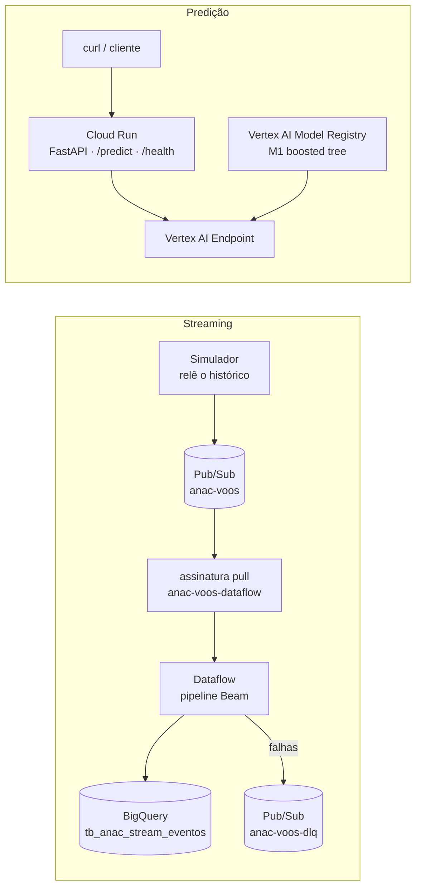

# Plano do Trabalho 2 — streaming e deploy do modelo

Plano de execução da segunda entrega, montado a partir do enunciado e do que
**de fato existe hoje** no projeto GCP (inventário feito em 06/10/2026).

| Item | Valor |
| --- | --- |
| Apresentação | **23/10/2026** — 5 min, estourar zera o quesito |
| Peso | Aplicação prática 60% · Apresentação 20% · Código 20% |
| Entregáveis | `.zip` com o código (repositório) + slides em PDF |
| Tag ao final | `v2-streaming` |

---

## 1. O que precisa estar rodando no dia

Duas demonstrações ao vivo, **independentes entre si**:

1. **Streaming:** o simulador publica eventos de voo no Pub/Sub, um job **Dataflow**
   os consome e as linhas aparecem no BigQuery durante a apresentação.
2. **Predição:** um `curl` na API do Cloud Run devolve a **probabilidade** de atraso,
   calculada pelo modelo implantado num endpoint do Vertex AI.

Nesta entrega o Dataflow **não** chama a API. A integração entre os dois fica para
o Trabalho Final. Manter os caminhos separados reduz o risco da demo: se um falhar,
o outro continua de pé.



---

## 2. Estado de partida

### Já pronto (herdado do T1)

- Dataset `tf_anac` (multi-região **US**) com Bronze, Silver e Gold. A Gold
  `tb_anac_gold_features_atraso` tem **6.187.534 linhas**, particionada por
  `dt_referencia` e clusterizada.
- Views `vw_anac_gold_treino_m1` e `vw_anac_gold_avaliacao_m1`, com o split temporal
  de 60 dias.
- Modelos BigQuery ML `mdl_anac_m1_boosted_tree` (final) e `mdl_anac_baseline_logreg`.
- `EXPORT MODEL` **já executado** em `gs://dados-anac-vra/models/`. O M1 saiu em
  formato XGBoost (`model.bst` + `main.py` + `xgboost_predictor-0.1.tar.gz`) e o
  baseline em SavedModel. Ou seja, a ponte para o Vertex está validada.
- APIs habilitadas: Vertex AI, Artifact Registry, BigQuery, Cloud Build, Pub/Sub,
  Cloud Run e Storage.

### Status em 09/10/2026

| Item | Situação |
| --- | --- |
| `schemas/features.json` | ✅ criado; aceita 99,97% da Gold real |
| Pub/Sub próprio (`anac-voos`, `anac-voos-dlq`, assinaturas) | ✅ criado pelo Terraform |
| API do Dataflow, Artifact Registry, bucket do Dataflow | ✅ criados pelo Terraform |
| Tabela `tb_anac_stream_eventos` | ✅ criada (partição diária, cluster) |
| Pipeline Dataflow | ✅ testado no GCP: 30/30 eventos gravados, lag médio de 3 s, inválido no dead-letter; job drenado |
| Simulador | ✅ testado contra a Gold real |
| Modelo no Vertex Model Registry | ✅ `anac_m1_boosted_tree` registrado direto do BigQuery ML |
| Endpoint | ✅ testado em 09/10: implantado em 33 min, **paridade conferida** (0,60772 no Vertex contra 0,6077 no `ML.PREDICT`) e desimplantado no mesmo dia. Religar em 21/10 com `scripts/t2/vertex_deploy.sh` — cobrado por hora |
| API no Cloud Run | ✅ publicada em 09/10 (`anac-api`, privada, `min-instances=0`): `/health` 200, voo válido 200 com `prob_atraso` 0,607721, payload inválido 422, chamada sem token 403 |
| Service accounts dedicadas | ⏳ prontas no Terraform (`manage_iam = true`); exige o Owner do projeto |
| Medição de p95 | ✅ 09/10: 50/50 chamadas, p50 337 ms, **p95 359 ms** (meta ≤ 800 ms), máx. 416 ms |

Como operar cada peça: [`t2-operacao.md`](t2-operacao.md).

### Recursos de aula no mesmo projeto — não usar

O projeto GCP também guarda exercícios de aula. Eles **não fazem parte do
trabalho** e não devem ser reaproveitados, alterados nem apagados:

| Recurso | Por que não usar |
| --- | --- |
| Pub/Sub `aula-pdm-primeiro-topico`, `aula-pdm-minha-primeira-assinatura` | Exercício introdutório de Pub/Sub |
| Pub/Sub `aula-pdm-anac`, `aula-pdm-anac-dlq`, `aula-pdm-anac-bq`, `aula-pdm-anac-dlq-sub` | Exercício de aula aplicado ao VRA. A assinatura grava **direto no BigQuery, sem Dataflow** (não atende o enunciado); as assinaturas expiram após 31 dias sem uso; e um segundo consumidor no mesmo tópico duplicaria as gravações |
| Tabela `tf_anac.tb_anac_silver_pubsub` | 11 linhas de teste do exercício acima (reenvio de voos de 22/02/2023, com duplicatas). Está no dataset do trabalho, mas não é do trabalho — ver decisão D3 |
| Datasets `aula_pdm`, `anuncios`, `erp`; buckets de MLOps e de anúncios das aulas; modelo Vertex `rf-preco-imoveis` | Outras atividades da disciplina |

Os recursos do trabalho usam o prefixo **`anac-`** para que a separação fique óbvia
no console.

---

## 3. Decisões a fechar até 09/10

| # | Decisão | Recomendação |
| --- | --- | --- |
| D1 | **Região** dos serviços regionais | `us-central1`. O dataset está em `US`, e modelos BigQuery ML de datasets `US` sincronizam com o Vertex AI justamente em `us-central1`. Vertex, Dataflow, Cloud Run e Artifact Registry ficam todos lá |
| D2 | **Modelo em cascata** (segundo modelo para a faixa de atraso) | Continua em aberto. Até haver decisão dos quatro, **só o binário** é escopo. Atenção: a Gold já grava `faixa_atraso`; se a cascata for descartada, a coluna sai da Gold |
| D3 | Destino de `tb_anac_silver_pubsub` | Deixar como está até o fim do T2 e remover depois, de comum acordo (é artefato de aula) |
| D4 | Formato do payload de `/predict` | As **10 features** do modelo, já derivadas (hora, dia da semana, mês, duração). É exatamente o que o Dataflow vai enviar no Trabalho Final |
| D5 | Quem apresenta | Definir até 16/10, para sobrar tempo de ensaio |
| D6 | Rotação das contas de faturamento | Ordem fixa definida antes de ligar o endpoint (21/10) |

---

## 4. Frentes de trabalho

Cinco frentes, distribuíveis entre os quatro integrantes. A frente **A** é pequena e
bloqueia B, C e D, então vai primeiro.

### A. Contrato de features — `schemas/features.json`

Fonte única das features, compartilhada pela Gold, pelo `CREATE MODEL`, pelo payload
da API e, no TF, pelo Dataflow. Conteúdo inicial, exatamente as 10 colunas das views
de treino:

| Feature | Tipo |
| --- | --- |
| `sg_empresa_icao`, `sg_icao_origem`, `sg_icao_destino`, `cd_tipo_linha`, `sg_equipamento_icao`, `dia_semana`, `mes` | `STRING` |
| `nr_assentos_ofertados`, `hora_partida_prevista`, `duracao_prevista_min` | `INT64` |

Nenhuma feature pode vir de horário real, situação do voo, justificativa ou
`ds_situacao_*`.

**Pronto quando:** o arquivo existe e a API gera o modelo de validação a partir
dele.

### B. Vertex AI — registro e endpoint

1. **Spike no primeiro dia.** Registrar o M1 direto do BigQuery ML no Model Registry:

   ```sql
   ALTER MODEL `<projeto>.tf_anac.mdl_anac_m1_boosted_tree`
   SET OPTIONS (vertex_ai_model_id = 'anac_m1_boosted_tree');
   ```

   Esse caminho preserva o pré-processamento do BigQuery ML. O M1 usa
   `LABEL_ENCODING`, então o modelo recebe as categorias como texto e não precisamos
   reimplementar a codificação.
2. **Fallback:** upload do artefato de `gs://dados-anac-vra/models/m1_boosted_tree/`
   com o container pré-construído de predição. **Nunca** servir o `model.bst` cru:
   ele espera as categorias já codificadas.
3. Deploy em endpoint `us-central1` com a menor máquina aceita e 1 réplica.
4. **Validação de paridade:** a probabilidade devolvida pelo endpoint para o voo de
   exemplo de `sql/ml/ml_predict_demo.sql` (GLO, SBGO→SBGR, 20/12, 18:30) precisa
   bater com a do `ML.PREDICT`.

O endpoint é cobrado por hora ligada. Depois do spike ele é **desimplantado** e só
volta em 21/10 (ver seção 5).

**Pronto quando:** o modelo está visível no Registry, o endpoint respondeu e a
paridade foi conferida.

### C. API de predição — `api/`

- FastAPI com dois endpoints:
  - `GET /health`: responde sem chamar o Vertex.
  - `POST /predict`: recebe as 10 features e devolve
    `{"prob_atraso": 0.27, "modelo": "..."}`.
- Validação com pydantic derivada de `schemas/features.json`. Payload inválido ou
  incompleto recebe **HTTP 422**.
- Devolve **probabilidade**, nunca só a classe. Payload autocontido: a API não
  consulta tabela alguma.
- Chamada ao endpoint com `google-cloud-aiplatform`. A autenticação usa a service
  account `anac-api` do próprio Cloud Run (papel `roles/aiplatform.user`), sem chave
  nem segredo no código. O ID do endpoint e a região vêm por variável de ambiente.
- `Dockerfile` e testes `pytest` com o Vertex mockado (válido, inválido → 422,
  health).
- Script de carga simples que mede a latência p95 de `/predict`. Meta: **≤ 800 ms**
  com `min-instances=1`.

**Pronto quando:** o `curl` contra a URL do Cloud Run devolve a probabilidade, o
payload inválido devolve 422 e o p95 foi medido.

### D. Streaming — `streaming/producer/` e `streaming/dataflow/`

- **Simulador** (`producer/`):
  - relê voos históricos da Silver/Gold no BigQuery, **nunca** a API ou o site da
    ANAC;
  - desloca os timestamps para "agora" e publica em `anac-voos` num ritmo
    configurável;
  - cada evento leva as chaves do voo e os campos previstos.
- **Pipeline Beam em Python** (`dataflow/`):
  - lê `ReadFromPubSub` da assinatura `anac-voos-dataflow`, faz parse e validação e
    grava com `WriteToBigQuery` em `tf_anac.tb_anac_stream_eventos`;
  - mensagens que falham no parse vão para `anac-voos-dlq`, sem descarte
    silencioso.
- DDL da tabela de destino em `sql/streaming/`, particionada por data de evento e
  clusterizada, seguindo o padrão das outras camadas.
- Meta: o evento aparece no BigQuery em **até 60 s** após a publicação.

**Pronto quando:** um job Dataflow em `us-central1` consome o tópico e as linhas
aparecem na tabela. O **primeiro job deve subir até 14/10**, porque é a peça com mais
chance de surpresa (permissões, workers, quotas).

### E. Infraestrutura, runbook e apresentação

**Terraform mínimo** (`terraform/`), só para recursos **estáveis e novos** do
trabalho:

- habilitar `dataflow.googleapis.com`;
- tópicos `anac-voos` e `anac-voos-dlq` e assinatura pull `anac-voos-dataflow` com
  política de dead-letter;
- repositório Docker no Artifact Registry (`us-central1`);
- service accounts `anac-api` e `anac-dataflow` com o mínimo de papéis;
- bucket de staging/temp do Dataflow.

Regras do Terraform:

- state remoto num bucket GCS;
- projeto e região por variável, com `terraform.tfvars` fora do Git (o repositório é
  público);
- **nenhum `import` e nenhuma referência a recursos `aula-*`**, para que um
  `terraform destroy` nunca alcance o material de aula.

**Fora do Terraform**, de propósito: tudo que liga e desliga por custo fica em
scripts idempotentes em `scripts/`, porque gerenciar isso no Terraform criaria drift
a cada demo.

- deploy e undeploy do modelo no endpoint;
- lançamento e drain do job Dataflow;
- deploy do Cloud Run (build da imagem + `gcloud run deploy`).

As tabelas do BigQuery continuam criadas por SQL, como nas camadas anteriores.

**Pronto quando:** `terraform apply` cria tudo do zero num projeto limpo e os
scripts de liga/desliga foram executados ao menos uma vez.

---

## 5. Runbook de custo

| Recurso | Cobrança | Regra |
| --- | --- | --- |
| Vertex AI Endpoint | Por hora com modelo implantado | Implantar em **21/10**; desimplantar **logo após a demo** em 23/10. Fora disso, só no spike, desligado no mesmo dia |
| Job Dataflow streaming | Por hora ligado | Ligar para testes e para a demo; **drain** sempre ao terminar |
| Cloud Run | Por uso | `min-instances=1` só na janela da demo; 0 no resto do tempo |
| Pub/Sub, Artifact Registry, BigQuery | Desprezível no volume do trabalho | Sem `SELECT *`; tabelas particionadas e clusterizadas |

---

## 6. Cronograma

| Período | Entregas |
| --- | --- |
| **06–09/10** | Decisões D1–D4 fechadas · `features.json` · spike do Vertex (registro + paridade) · Terraform aplicado |
| **10–16/10** | API no Cloud Run chamando o endpoint · simulador publicando · **1º job Dataflow até 14/10** · D5 definida |
| **17–20/10** | Testes da API · latência p95 medida · runbook executado ponta a ponta · slides |
| **21–22/10** | Endpoint implantado · **2 ensaios cronometrados ≤ 5 min** · tag `v2-streaming` · `.zip` e PDF |
| **23/10** | Apresentação · undeploy do endpoint e drain do Dataflow no mesmo dia |

---

## 7. Roteiro da demonstração (5 min)

| Tempo | Conteúdo |
| --- | --- |
| 0:00–0:45 | Pergunta de negócio e arquitetura do T2 em um slide (o diagrama da seção 1) |
| 0:45–2:30 | Simulador publicando → job Dataflow no console → `SELECT COUNT(*)` na tabela de eventos crescendo |
| 2:30–4:00 | `curl` válido → probabilidade · `curl` com campo faltando → 422 · `/health` |
| 4:00–4:45 | Latência p95 medida e custo controlado (liga/desliga) |
| 4:45–5:00 | Próximo passo: no TF o Dataflow chama a API e enriquece o evento |

Ter um **plano B gravado** (prints e vídeo curto de cada passo) para o caso de o
console demorar ao vivo.

---

## 8. Riscos

| Risco | Mitigação |
| --- | --- |
| Registro do M1 no Vertex não se comporta como esperado | Spike no primeiro dia; fallback pelo artefato exportado já definido |
| Primeiro job Dataflow falha por permissão, quota ou worker | Subir até 14/10; SA `anac-dataflow` dedicada; testar com `DirectRunner` antes |
| Esquecer o endpoint ou o Dataflow ligados | Runbook com responsável nomeado; conferir o console no fim de cada sessão |
| Cold start do Cloud Run durante a demo | `min-instances=1` na janela da apresentação |
| Features divergentes entre API e modelo | `schemas/features.json` como fonte única; teste de paridade com `ML.PREDICT` |
| Mexer sem querer em recurso de aula | Prefixo `anac-`; Terraform sem `import` nem referência a `aula-*` |
| Estourar os 5 minutos | Dois ensaios cronometrados; roteiro fixo da seção 7 |

---

## 9. Checklist de entrega

Itens marcados foram verificados nos testes de 07/10 (streaming) e 09/10
(predição). No dia da demo, todos se repetem.

- [x] Modelo visível no Vertex AI Model Registry
- [x] Endpoint ativo e respondendo, com paridade conferida contra o `ML.PREDICT`
- [x] `POST /predict` devolve probabilidade para payload válido
- [x] `POST /predict` devolve 422 para payload inválido
- [x] `GET /health` responde
- [x] Simulador publica com timestamp deslocado
- [x] Dataflow consome o tópico e grava no BigQuery
- [ ] Linhas chegam à tabela durante a demo
- [x] Latência p95 de `/predict` medida e dentro da meta
- [ ] Undeploy do endpoint e drain do Dataflow executados após a demo
- [ ] Dois ensaios cronometrados ≤ 5 min
- [ ] Tag `v2-streaming`, `.zip` do código e slides em PDF
