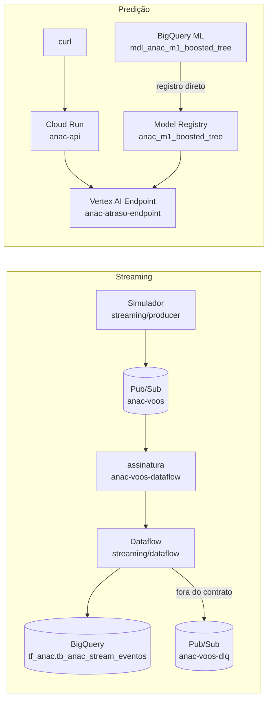

# Trabalho 2 — como rodar, ligar e desligar

Guia operacional do streaming e da API de predição. Os comandos rodam a partir
da raiz do repositório e leem as variáveis de `.env`. Copie `.env.example`, que
não leva valores reais.

```bash
cp .env.example .env   # preencha PROJECT_ID; o resto tem padrão
```

Pré-requisitos: `gcloud` autenticado (`gcloud auth login --update-adc`), `uv`,
`terraform` ≥ 1.9 e `docker` (opcional, para testar a imagem localmente).

---

## 1. O que existe e onde



| Peça | Código | Criada por |
| --- | --- | --- |
| Contrato de features | `schemas/features.json` | — |
| Tópicos, assinaturas, repositório de imagens, bucket do Dataflow | `terraform/` | `terraform apply` (uma vez) |
| Tabela de eventos | `sql/streaming/create_table_stream_eventos.sql` | `scripts/t2/stream_table.sh` (uma vez) |
| Simulador | `streaming/producer/simulator.py` | — |
| Pipeline Beam | `streaming/dataflow/pipeline/` | `scripts/t2/dataflow_start.sh` |
| Modelo no Vertex | `ALTER MODEL ... vertex_ai_model_id` | `scripts/t2/vertex_register.sh` (uma vez) |
| Endpoint com o modelo implantado | — | `scripts/t2/vertex_deploy.sh` |
| API | `api/` | `scripts/t2/api_deploy.sh` |

O streaming e a API são **independentes** nesta entrega: o Dataflow não chama a
API. Se um dos dois falhar na apresentação, o outro continua de pé.

---

## 2. Infraestrutura base (uma vez)

```bash
cd terraform
cp terraform.tfvars.example terraform.tfvars          # preencha project_id
terraform init -backend-config="bucket=<PROJECT_ID>-anac-tfstate"
terraform plan -out t2.tfplan && terraform apply t2.tfplan
cd ..
./scripts/t2/stream_table.sh
./scripts/t2/vertex_register.sh
```

O Terraform só cria recursos com prefixo `anac-` e nunca importa nem altera os
exercícios de aula que existem no mesmo projeto. O bucket do state é criado à
mão, uma única vez: o Terraform não pode guardar o state no próprio recurso que
ele cria.

`manage_iam = true` cria service accounts dedicadas (`anac-api`,
`anac-dataflow`) com papéis mínimos. Exige quem administre IAM no projeto
(Owner). Com `false`, que é o padrão, Cloud Run e Dataflow usam a conta padrão
do Compute Engine. Depois de aplicar com `true`, preencha `API_SERVICE_ACCOUNT`
e `DATAFLOW_SERVICE_ACCOUNT` no `.env`.

---

## 3. Liga e desliga — controle de custo

| Recurso | Cobrança | Liga | Desliga |
| --- | --- | --- | --- |
| Modelo no endpoint do Vertex | **por hora implantado** (≈ US$ 0,10/h em `n1-standard-2`) | `vertex_deploy.sh` (~15 min) | `vertex_undeploy.sh` |
| Job Dataflow | **por hora ligado** | `dataflow_start.sh` (~4 min) | `dataflow_drain.sh` |
| Cloud Run | por uso; escala a zero | `api_deploy.sh --demo` (1 instância quente) | `api_deploy.sh` (volta a zero) |
| Pub/Sub, BigQuery, Artifact Registry | desprezível no volume da demo | — | — |

Regras:

- O endpoint fica ligado **só de 21/10 até o fim da apresentação em 23/10**.
- Todo teste com Dataflow termina com `dataflow_drain.sh`. O drain processa o
  que já chegou antes de encerrar, então nenhum evento se perde.
- Ao fim de cada sessão de trabalho, confira o console: Vertex AI → Endpoints
  (nenhum modelo implantado) e Dataflow → Jobs (nenhum `Running`).

---

## 4. Roteiro da demo (5 min)

Preparação (até 30 min antes):

```bash
./scripts/t2/vertex_deploy.sh        # se ainda nao estiver implantado
./scripts/t2/api_deploy.sh --demo    # min-instances=1: sem cold start
./scripts/t2/dataflow_start.sh       # espere o job ficar Running
./scripts/t2/predict.sh --health     # aquece a API
```

Ao vivo:

| Tempo | Comando | O que mostrar |
| --- | --- | --- |
| 0:45 | `./scripts/t2/simulate.sh --limite 100 --por-segundo 5` | eventos publicados |
| 1:30 | consulta `sql/streaming/monitor_stream_eventos.sql` no console do BigQuery | contagem subindo, lag em segundos |
| 2:15 | `./scripts/t2/simulate.sh --invalido` | evento com campo pós-partida vai para o dead-letter |
| 2:45 | `./scripts/t2/predict.sh` | `prob_atraso` vinda do Vertex |
| 3:15 | `./scripts/t2/predict.sh --invalido` | HTTP 422 |
| 3:45 | `./scripts/t2/latency.sh` | p95 da API |

Depois da apresentação, no mesmo dia:

```bash
./scripts/t2/dataflow_drain.sh
./scripts/t2/vertex_undeploy.sh
./scripts/t2/api_deploy.sh           # volta a escalar a zero
```

---

## 5. Decisões de implementação

**Registro direto do BigQuery ML no Vertex.** O `ALTER MODEL ... SET OPTIONS
(vertex_ai_model_id = ...)` publica no Model Registry o modelo **vigente** no
BigQuery, e o container do Vertex faz o pré-processamento das categorias. O
artefato exportado no GCS (`gs://dados-anac-vra/models/m1_boosted_tree/`) é de
um treino anterior: foi exportado em 10/09 às 14:43 UTC, antes do treino final
de 11/09. Por isso ele dá 0,634 para o voo de exemplo, enquanto o `ML.PREDICT`
dá 0,608. Servir pelo registro direto elimina essa divergência.

**Contrato tolerante ao dado real.** `schemas/features.json` aceita 99,97% da
Gold (6.185.567 de 6.187.534 linhas). As 1.967 recusadas são sujeira do
histórico: assentos negativos, equipamento nulo, tipo de linha vazio.
`cd_tipo_linha` aceita qualquer letra. O modelo só aprendeu C, G, I, N e X, mas
R, E, L e H aparecem em 2,4% dos voos, e o modelo os trata como valor ausente
sem quebrar. Recusá-los mandaria voos reais para o dead-letter durante a demo.

**O simulador não publica o que o contrato recusa.** A consulta do simulador
deriva os filtros do próprio contrato. A demonstração do dead-letter é um passo
explícito (`--invalido`), em vez de depender de uma linha suja aparecer por
acaso.

**Dead-letter dentro do pipeline.** O pipeline publica em `anac-voos-dlq`
toda mensagem que viola o contrato, com o motivo e o payload original. A
política de dead-letter nativa do Pub/Sub não é usada, porque exige conceder
papéis à conta de serviço do Pub/Sub.

**Escrita no BigQuery por streaming inserts.** A Storage Write API do Beam não
converte colunas `DATETIME` em schema explícito. Os streaming inserts aceitam
`DATETIME` e `TIMESTAMP` como texto ISO e gravam em segundos (lag medido de 3 s
em média).

**API privada.** O Cloud Run não aceita chamadas anônimas; a demo usa o token
de identidade do `gcloud` (`predict.sh`). O repositório é público e o endpoint
do Vertex é cobrado. Uma URL aberta seria abuso esperando para acontecer.

**Cota das bibliotecas Python.** Os scripts fixam `GOOGLE_CLOUD_QUOTA_PROJECT`
no projeto do trabalho. As credenciais ADC de quem roda podem apontar a cota
para outro projeto pessoal, e então o Dataflow recusa o job com
`SERVICE_DISABLED` em um projeto que não é o nosso.

---

## 6. Testes

```bash
(cd api && uv run --group dev pytest -q)
(cd streaming/dataflow && uv run --no-project --with-requirements requirements.txt --with pytest python -m pytest -q tests)
(cd streaming/producer && uv run --no-project --with "apache-beam[gcp]==2.77.0" --with pytest python -m pytest -q tests)
```

Os testes do pipeline rodam o `DoFn` no DirectRunner, sem Pub/Sub nem BigQuery.
O teste do simulador confere que todo evento que ele publica passa na validação
do pipeline: os dois compartilham o contrato.
